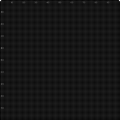

# pico-sdl

[![Tests][badge]][tests]

[badge]: https://github.com/fsantanna/pico-sdl/actions/workflows/tests.yml/badge.svg
[tests]: https://github.com/fsantanna/pico-sdl/actions/workflows/tests.yml

***A 2D graphics library for C and Lua***

[
    [`v0.3`](https://github.com/fsantanna/pico-sdl/tree/v0.3/) |
    [`v0.2`](https://github.com/fsantanna/pico-sdl/tree/v0.2/) |
    [`v0.1`](https://github.com/fsantanna/pico-sdl/tree/v0.1/)
]

This is the unstable `main` branch.
Please, switch to stable [`v0.3`](https://github.com/fsantanna/pico-sdl/tree/v0.3).

[
    [About](#about)                 |
    [Hello World!](#hello-world)    |
    [Design](#design)               |
    [Install & Run](#install--run)  |
    [Documentation](#documentation) |
    [Testing](#testing)
]

# About

`pico-sdl` is a C graphics library for 2D games and applications.

See also [pico-lua](lua/), the official Lua binding for `pico-sdl`.


`pico-sdl` is designed around 3 groups of APIs:

- `pico_output_*` for output operations,
    such as drawing shapes and playing audio.
- `pico_input_*` for input events,
    such as waiting time and key presses.
- `pico_get_*` and `pico_set_*` for the library state,
    such as modifying the drawing color and style.

# Hello World!

The following example draws an `X` on screen gradually, pixel by pixel:

<picture>

</picture>

```c
#include "pico.h"
int main (void) {
    pico_init(1);
    for (int i=0; i<100; i++) {
        pico_output_draw_pixel (
            &(Pico_Rel_Pos) { '!', {i, i}, PICO_ANCHOR_C, NULL }
        );
        pico_output_draw_pixel (
            &(Pico_Rel_Pos) { '!', {99-i, i}, PICO_ANCHOR_C, NULL }
        );
        pico_input_delay(30);
    }
    pico_init(0);
    return 0;
}
```

We start with `pico_init(1)` to open the library, terminating with
`pico_init(0)` to close it.
Then, we run `100` loop iterations to draw pixels in opposite directions to
form the animated `X` shown on the right.

By default, `pico-sdl` creates a `100x100` logical canvas embedded in a
`500x500` physical window.
This enables `pico-sdl` to draw a grid of `5x5` pixel size to ease
visualization and aid development.

In the example, we use `Pico_Rel_Pos` with raw mode `'!'` to specify absolute,
exact positions.
`pico-sdl` also supports modes `'%'` and `'#'` for percent- and tile-based
coordinates, respectively.

# Design

`pico-sdl` targets educational use, being guided by the following principles:

- Standardized APIs, as described above
- Immediate display through single-buffer rendering
- Sensible default settings, such as initial colors and a built-in font
- Runtime visual aids, such as a grid for logical pixels and zoom & scroll support
- Simplicity over flexibility

In particular, as the example above illustrates, immediate display allows that
students view the result of their operations at any point, in real time.

`pico-sdl` is implemented built over [SDL][sdl], which is a flexible and lower
level API.
This allows programmers to fallback to SDL whenever required.

[sdl]:    https://en.wikipedia.org/wiki/Simple_DirectMedia_Layer

# Install & Run

We assume a Linux machine:

```
sudo apt-get install libsdl2-dev libsdl2-image-dev libsdl2-mixer-dev libsdl2-ttf-dev libsdl2-gfx-dev
```

Clone `pico-sdl`:

```
git clone https://github.com/fsantanna/pico-sdl
cd pico-sdl/    # executable is here
```

Run:

```
./pico-sdl tst/main.c
```

# Documentation

- [Doxygen API][api]

[api]: https://fsantanna.github.io/pico-sdl/v0.3/

# Testing

## Automatic Tests

```bash
make tests
```

## Interactive Test

```bash
make int T=colors   # set T= to any test in `tst/`
```
