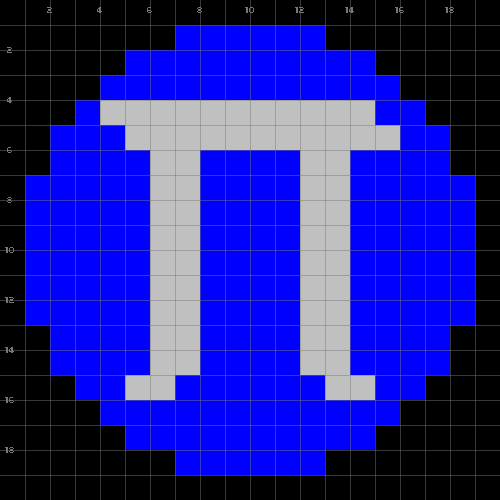

# pico-lua



[![Tests][badge]][tests]

[badge]: https://github.com/fsantanna/pico-sdl/actions/workflows/tests.yml/badge.svg
[tests]: https://github.com/fsantanna/pico-sdl/actions/workflows/tests.yml

***Lua binding for [pico-sdl](../)***

[
    [`v0.6`](https://github.com/fsantanna/pico-sdl/tree/v0.6/lua/) |
    [`v0.5`](https://github.com/fsantanna/pico-sdl/tree/v0.5/lua/) |
    [`v0.3.1`](https://github.com/fsantanna/pico-sdl/tree/v0.3.1/lua/) |
    [`v0.2`](https://github.com/fsantanna/pico-sdl/tree/v0.2/lua/) |
    [`v0.1`](https://github.com/fsantanna/pico-sdl/tree/v0.1/lua/)
]

This is the unstable `main` branch.
Please, switch to stable [`v0.6`](https://github.com/fsantanna/pico-sdl/tree/v0.6/lua/).

[
    [About](#about)                 |
    [Hello World!](#hello-world)    |
    [Install & Run](#install--run)  |
    [Documentation](#documentation) |
    [Testing](#testing)
]

# About

`pico-lua` is the Lua binding for [pico-sdl][pico-sdl], a graphics library for
2D games and applications.

[pico-sdl]: https://github.com/fsantanna/pico-sdl/

# Hello World!

The following example draws an `X` on screen gradually with instant feedback:

<picture>

</picture>

```lua
pico.init(true)
for i=0, 99 do
    pico.output.draw.pixel { '!', x=i,    y=i }
    pico.output.draw.pixel { '!', x=99-i, y=i }
    pico.input.delay(30)
end
pico.init(false)
```

# Install & Run

## Luarocks

```
sudo apt install liblua5.4-dev libsdl2-dev libsdl2-gfx-dev libsdl2-image-dev libsdl2-mixer-dev libsdl2-ttf-dev
sudo luarocks install pico-sdl 0.6
pico-lua lua/tst/cross.lua
```

## Development

From `luarocks.org`:

```
sudo luarocks install --dev pico-sdl
```

From local repo:

```
cd ../  # pico-sdl root
sudo luarocks make lua/pico-sdl-dev-2.rockspec
```

Then run the program:

```
pico-lua lua/tst/cross.lua
```

# Documentation

- [Guide](doc/guide.md)
- [API](doc/api.md)

# Testing

## Automatic Tests

```bash
make tests
```

## Interactive Test

```bash
make int T=colors   # set T= to any test in `tst/`
```
