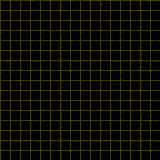

# pico-sdl-lua

A Lua binding for [pico-sdl](#../).

<!--
[
    [`v0.1`](https://github.com/fsantanna/pico-sdl/tree/v0.1)
]

This is the unstable `main` branch.
Please, switch to stable [`v0.1`](https://github.com/fsantanna/pico-sdl/tree/v0.1).
-->

[
    [About](#about)                 |
    [Hello World!](#hello-world)    |
    [Install & Run](#install--run)  |
    [Environments](#environments)   |
    [Documentation](#documentation) |
    [Resources](#resources)
]


# Hello World!

The following example draws an `X` on screen gradually with instant feedback:

<picture>

</picture>

```
local pico = require 'pico'
pico.init(true)
pico.set.size({x=160,y=160}, {x=16,y=16})
pico.output.clear()
pico.input.event('key.up')
for i=1, 16 do
    pico.output.draw.pixel(i-1, i-1)
    pico.output.draw.pixel(16-i, i-1)
    pico.input.delay(100)
end
pico.input.delay(1000)
pico.init(false)
```

# Install & Run

## Dependencies

```
sudo apt install libsdl2-dev libsdl2-gfx-dev libsdl2-image-dev libsdl2-mixer-dev libsdl2-ttf-dev
```

## Luarocks

```
sudo luarocks install pico-sdl
pico-lua tst/x.lua
```

## Manual

Assumes `lua5.4`:

```
gcc -shared -o pico.so -fPIC ../src/pico.c ../src/hash.c pico.c -llua5.4 -lSDL2 -lSDL2_gfx -lSDL2_ttf -lSDL2_mixer -lSDL2_image
sudo cp pico-lua /usr/local/bin/
sudo cp pico.so /usr/local/share/lua/5.4/
pico-lua tst/main.lua
```

# Documentation

<!--
- [Guide](guide.md)
-->

- [API](doc/api.md)
