# Guide

1. [Introduction](#1-introduction)
2. [Initialization](#2-initialization)
3. [Basic Drawing](#3-basic-drawing)
4. [Internal State](#4-internal-state)
5. [Positioning: Mode & Anchor](#5-positioning-mode--anchor)
6. [Advanced View](#6-advanced-view)
7. [Events](#7-events)
8. [Expert Mode](#8-expert-mode)

# 1. Introduction

`pico-lua` is a graphics library for 2D games and applications.
It is designed around 3 groups of APIs:

- `pico.output.*` for output operations,
    such as drawing shapes and playing audio.
- `pico.input.*` for input events,
    such as waiting time and key presses.
- `pico.get.*` and `pico.set.*` for the library state,
    such as the drawing color, and window title.

This guide is an interactive walk-through of `pico-lua`.
It is not meant to be exhaustive: consult the [API](api.md) for completeness.

From the command line, simply execute `pico-lua` with no parameters:

```bash
$ pico-lua
Lua 5.4.4  Copyright (C) 1994-2022 Lua.org, PUC-Rio
>
```

The Lua prompt `>` indicates that `pico-lua` is ready to receive commands.

<!--
**Basic Structure:**

Every pico-lua program follows this pattern:

```lua
pico.init(true)     -- initialize the library
-- ... drawing and input operations ...
pico.init(false)    -- finalize the library
```

**Internal State:**

The library maintains global state including:

- Colors (draw and clear)
- Alpha transparency
- Drawing style (fill or stroke)
- View configuration (window size, world size, zoom)
-->

# 2. Initialization

## 2.1. Open

To initialize `pico-lua`, we call `pico.init(true)`:

<table>
<tr><td><pre>
> pico.init(true)
</pre>
</td><td>

</td></tr>
</table>

We immediately see a `500x500` window divided in `100x100` small rectangles
representing logical pixels.

By default, `pico-lua` conventionally exhibit a grid and coordinate labels to
aid development with visual inspection.
You may click in the image to zoom in.

## 2.2. Configure

To change the window title, grid, and size, we call `pico.set.view`:

<table>
<tr><td><pre>
> pico.set.view {
    title  = "Hello!",            -- changes title
    grid   = false,               -- disables grid
    window = {'!', w=200, h=200}, -- physical size
    world  = {'!', w=200, h=200}, -- logical size
  }
</pre>
</td><td>
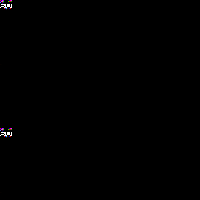
</td></tr>
</table>

Now the window title is set, the grid is disabled, and the window and world
sizes are the same.
The character `'!'` indicates a dimension in "raw mode", which we discuss
further.

## 2.3. Close

In the end, we call `pico.init(false)` to terminate `pico-lua`:

<table>
<tr><td><pre>
> pico.init(false)
</pre>
</td><td>
(no image)
</td></tr>
</table>

Then, we can restart `pico-lua` by calling `pico.init(true)` again:

<table>
<tr><td><pre>
> pico.init(true)
</pre>
</td><td>

</td></tr>
</table>

We can see that the title, grid, and sizes are now reset to default.

# 3. Basic Drawing

Drawing operations appear immediately on screen:
`pico-lua` simulates single-buffer rendering to ease prototyping.

## 3.1. Pixel

To draw a single pixel, we call `pico.output.draw.pixel`:

<table>
<tr><td><pre>
> pico.output.draw.pixel({'!', x=50, y=50})
</pre>
</td><td>
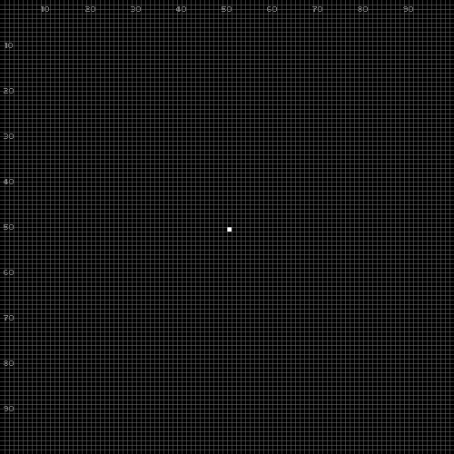
</td></tr>
</table>

The pixel occupies a physical `5x5` square representing a single logical pixel,
as expected.

## 3.2. Clear

To clear the screen, we call `pico.output.clear`:

<table>
<tr><td><pre>
> pico.output.clear()
</pre>
</td><td>

</td></tr>
</table>

The pixel is gone.

## 3.3. Rectangle

To draw a rectangle, we call `pico.output.draw.rect`:

<table>
<tr><td><pre>
> pico.output.draw.rect({'!', x=20, y=20, w=30, h=30})
</pre>
</td><td>
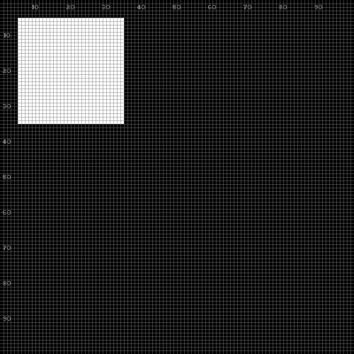
</td></tr>
</table>

The table specifies a rectangle at position `(20,20)` with size `30x30`.

Unlike most graphics libraries, `pico-lua` centers the rectangle at the given
position by default.
We discuss positioning and anchoring further.

## 3.4. Image

To draw an image, we call `pico.output.draw.image`:

<table>
<tr><td><pre>
> pico.output.draw.image('img/open.png', {'!', x=70, y=20, w=20, h=20})
</pre>
</td><td>
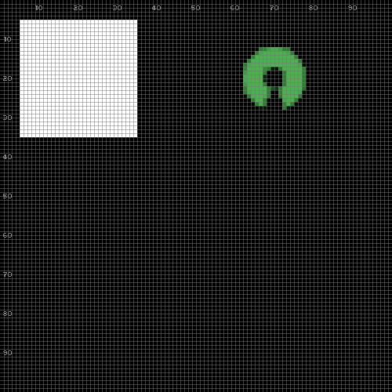
</td></tr>
</table>

Other drawing operations include `draw.line`, `draw.polygon`, and `draw.text`.

# 4. Internal State

`pico-lua` maintains internal state that affects drawing operations, such as
the current color, alpha transparency, and drawing style.

## 4.1. Color

To change the drawing color for further operations, we call
`pico.set.color.draw`:

<table>
<tr><td><pre>
> pico.set.color.draw('red')
> pico.output.draw.text("Hello", {'!', x=50, y=80, h=10})
</pre>
</td><td>
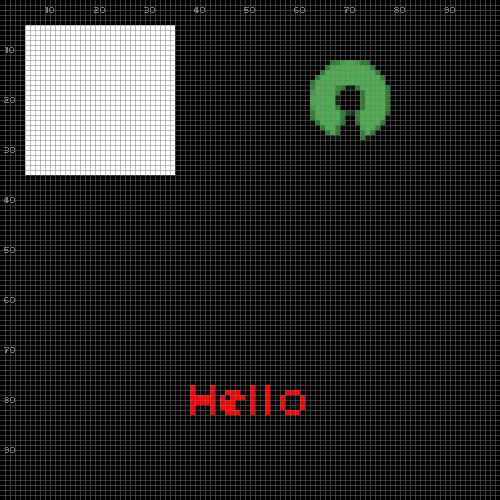
</td></tr>
</table>

The text appears in red, centered at the given position.

Note that the text width should not be set to preserve the correct aspect
ratio.

## 4.2. Transparency

We may also change the drawing transparency:

<table>
<tr><td><pre>
> pico.set.color.alpha(0x88)
> pico.output.draw.oval({'!', x=50, y=80, w=35, h=15})
</pre>
</td><td>

</td></tr>
</table>

The oval appears on top of the text, but the transparency keeps the text
visible.

# 5. Positioning: Mode & Anchor

`pico-lua` supports positioning **modes** as follows:

- `'!'` - Raw: logical pixel coordinates
- `'%'` - Percentage: coordinates relative to the world size (from `0.0` to `1.0`)
- `'#'` - Tile: grid coordinates based on a tile dimension

The mode must be set at index `1` of position, dimension, and rectangle tables.

## 5.1. Percentages

Since we already used the raw mode in previous sections, let's now try
percentages:

<table>
<tr><td><pre>
> pico.output.clear()
> pico.output.draw.rect({'%', x=0.5, y=0.5, w=0.5, h=0.5})
</pre>
</td><td>
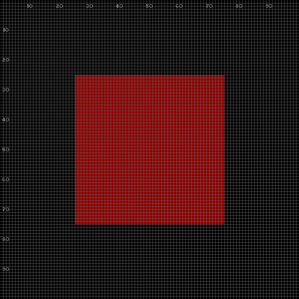
</td></tr>
</table>

The rectangle is centered at `(0.5, 0.5)`, or half, of the screen.

The rectangle appears in gray because the drawing color white applies with the
half transparency (`0xCC`) over a black background.

## 5.2. Anchors

In addition to positioning mode, `pico-lua` also supports anchoring, which
determines the reference point within a shape:

<table>
<tr><td><pre>
> pico.output.clear()
> pico.output.draw.pixel({'%', x=0.5, y=0.5})
> pico.set.color.draw('red')
> pico.output.draw.rect({'%', x=0.5, y=0.5, w=0.3, h=0.3, anc='NW'})
> pico.set.color.draw('green')
> pico.output.draw.rect({'%', x=0.5, y=0.5, w=0.3, h=0.3, anc='C'})
> pico.set.color.draw('blue')
> pico.output.draw.rect({'%', x=0.5, y=0.5, w=0.3, h=0.3, anc='SE'})
</pre>
</td><td>
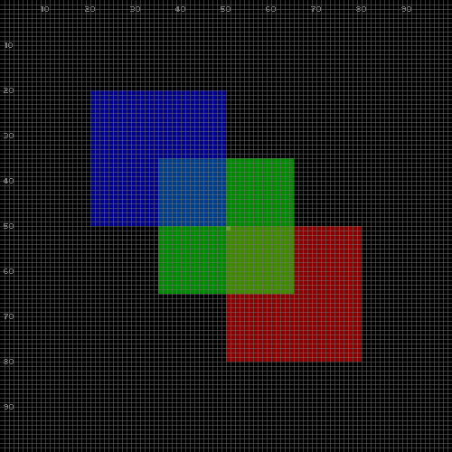
</td></tr>
</table>

We draw all three rectangles at the same pixel position, but with different
anchors.

The anchor determines the position inside the object that should appear at the
given drawing point:

```
+-----------+
|NW   N   NE|
| W   C   E |
|SW   S   SE|
+-----------+
```

By default, `pico-lua` uses the center anchor.

## 5.3. Tiles

TODO
The tile mode

For tile-based games, we can use tile mode with 1-indexed coordinates:

<table>
<tr><td><pre>
> pico.init(true)
> pico.set.view {
    window = {'!', w=200, h=200},
    world  = {'#', w=4, h=4},
    tile   = {w=25, h=25},
  }
> pico.output.clear()
> pico.output.draw.rect({'#', x=1, y=1, w=1, h=1})
> pico.output.draw.rect({'#', x=3, y=2, w=1, h=1})
> pico.output.draw.rect({'#', x=2, y=4, w=2, h=1})
</pre>
</td><td>
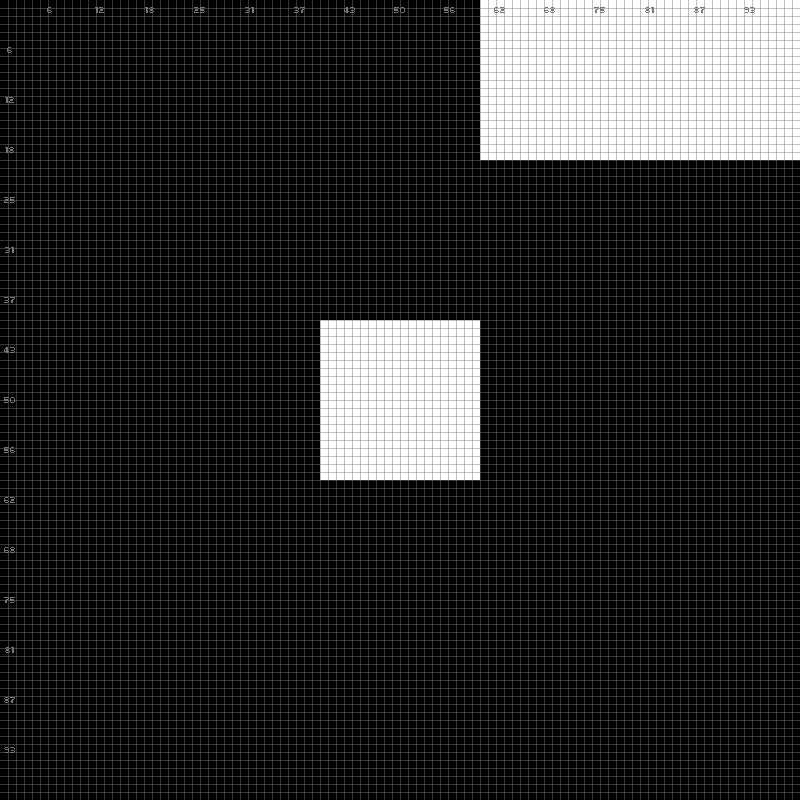
</td></tr>
</table>

The world is a 4x4 grid where each tile is 25x25 pixels.
Tile `(1,1)` is the top-left corner.

# 6. Advanced View

When the world is smaller than the window, the view is zoomed in.
Let's compare 1:1 and 2x zoom:

<table>
<tr><td><pre>
> pico.init(true)
> pico.set.view {
    window = {'!', w=200, h=200},
    world  = {'!', w=200, h=200},  -- 1:1
  }
> pico.output.clear()
> pico.output.draw.rect({'!', x=50, y=50, w=100, h=100})
</pre>
</td><td>
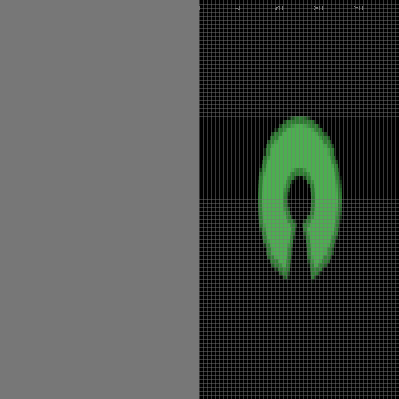
</td></tr>
</table>

<table>
<tr><td><pre>
> pico.set.view {
    world  = {'!', w=100, h=100},  -- 2x zoom
  }
</pre>
</td><td>
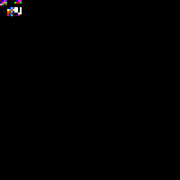
</td></tr>
</table>

The same logical rectangle appears twice as large with 2x zoom.

The `source` parameter pans the view:

<table>
<tr><td><pre>
> pico.set.view {
    world  = {'!', w=200, h=200},
    source = {'!', x=50, y=50, w=200, h=200},
  }
</pre>
</td><td>
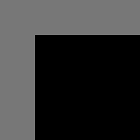
</td></tr>
</table>

The view is scrolled by `(50, 50)`, so the rectangle appears at the top-left.

# 7. Events

The `pico.input.delay(ms)` function pauses execution for a given time:

<table>
<tr><td><pre>
> pico.init(true)
> pico.output.clear()
> pico.output.draw.pixel({'!', x=25, y=50})
> pico.input.delay(500)
> pico.output.draw.pixel({'!', x=50, y=50})
> pico.input.delay(500)
> pico.output.draw.pixel({'!', x=75, y=50})
</pre>
</td><td>
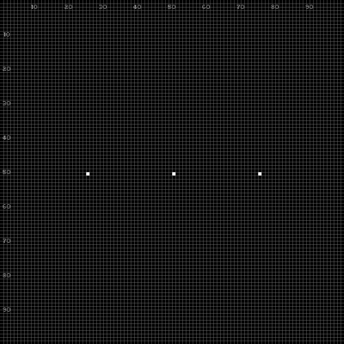
</td></tr>
</table>

The `pico.input.event()` function waits for input events:

```lua
> while true do
    local e = pico.input.event()
    if e.tag == 'quit' then
        break
    elseif e.tag == 'key.dn' then
        print("Key pressed: " .. e.key)
    end
  end
```

Event types include `'quit'`, `'key.dn'`, `'key.up'`, `'mouse.button.dn'`,
`'mouse.button.up'`, and `'mouse.motion'`.

We can also filter events and set timeouts:

```lua
> local e = pico.input.event('key.dn')        -- wait for key press only
> local e = pico.input.event('key.dn', 1000)  -- wait up to 1000ms
```

The `pico.get.mouse(pos)` function polls the current mouse position:

```lua
> local pos = {'!', x=0, y=0}
> pico.get.mouse(pos)
> print(pos.x, pos.y)
```

# 8. Expert Mode

By default, `pico-lua` uses immediate mode: every draw operation is visible
instantly.
Expert mode disables this, requiring explicit `present()` calls.

<table>
<tr><td><pre>
> pico.init(true)
> pico.set.expert(true)
> pico.output.clear()
> pico.output.draw.rect({'!', x=25, y=25, w=50, h=50})
</pre>
</td><td>

</td></tr>
</table>

Nothing is visible yet because we haven't called `present()`.

<table>
<tr><td><pre>
> pico.output.present()
</pre>
</td><td>

</td></tr>
</table>

Now the rectangle is visible.

Expert mode is useful for animation with controlled frame timing:

```lua
> pico.set.expert(true)
> while true do
    local start = pico.get.ticks()
    -- draw frame here
    pico.output.present()
    local elapsed = pico.get.ticks() - start
    if elapsed < 16 then
        pico.input.delay(16 - elapsed)  -- ~60 FPS
    end
  end
```
