# Guide

1. [Introduction](#1-introduction)
2. [Initialization](#2-initialization)
3. [Basic Drawing](#3-basic-drawing)
4. [Positioning: Mode & Anchor](#4-positioning-mode--anchor)
5. [Advanced View](#5-advanced-view)
6. [Events](#6-events)
7. [Expert Mode](#7-expert-mode)

# 1. Introduction

Pico-lua provides Lua bindings for the pico-sdl graphics library, designed for
educational 2D game development with immediate visual feedback.

**Goals:**

- Simple API for beginners
- Immediate rendering (single-buffer): see changes instantly
- Visual debugging aids: grid overlay, zoom support
- Flexible positioning: pixels, percentages, or tiles

**Basic Structure:**

Every pico-lua program follows this pattern:

```lua
pico.init(true)     -- initialize the library
-- ... drawing and input operations ...
pico.init(false)    -- finalize the library
```

**Internal State:**

The library maintains global state including:

- Colors (draw and clear)
- Alpha transparency
- Drawing style (fill or stroke)
- View configuration (window size, world size, zoom)

# 2. Initialization

The `pico.init` function initializes and finalizes the library.
The `pico.set.view` function configures the window.

<table>
<tr><td><pre>
> pico.init(true)
> pico.output.clear()
</pre>
</td><td>

</td></tr>
</table>

The default window is 500x500 pixels with a 100x100 logical world (5x zoom)
and a visible grid.

## 2.1. Window Title

<table>
<tr><td><pre>
> pico.init(true)
> pico.set.view { title="Hello!" }
> pico.output.clear()
</pre>
</td><td>
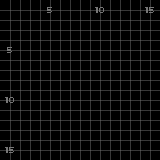
</td></tr>
</table>

## 2.2. Grid Toggle

<table>
<tr><td><pre>
> pico.init(true)
> pico.set.view { title="No Grid", grid=false }
> pico.output.clear()
</pre>
</td><td>

</td></tr>
</table>

## 2.3. Custom Size

The `window` sets the physical pixel dimensions.
The `world` sets the logical coordinate space.

<table>
<tr><td><pre>
> pico.init(true)
> pico.set.view {
>>     title  = "Custom Size",
>>     window = {'!', w=160, h=160},
>>     world  = {'!', w=8, h=8},
>> }
> pico.output.clear()
</pre>
</td><td>

</td></tr>
</table>

Here the window is 160x160 physical pixels, but the world is only 8x8 logical
units, creating a 20x zoom effect.

# 3. Basic Drawing

Drawing operations appear immediately on screen (single-buffer rendering).

## 3.1. Clear

<table>
<tr><td><pre>
> pico.init(true)
> pico.output.clear()
</pre>
</td><td>

</td></tr>
</table>

The `clear()` function fills the screen with the clear color (black by
default).

## 3.2. Pixel

<table>
<tr><td><pre>
> pico.init(true)
> pico.output.clear()
> pico.output.draw.pixel({'!', x=8, y=8})
</pre>
</td><td>
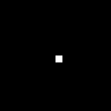
</td></tr>
</table>

## 3.3. Rectangle

<table>
<tr><td><pre>
> pico.init(true)
> pico.output.clear()
> pico.output.draw.rect({'!', x=4, y=4, w=8, h=8, anc='NW'})
</pre>
</td><td>
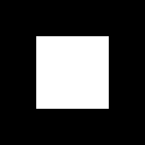
</td></tr>
</table>

## 3.4. Line

<table>
<tr><td><pre>
> pico.init(true)
> pico.output.clear()
> pico.output.draw.line({'!', x=2, y=2}, {'!', x=14, y=14})
</pre>
</td><td>
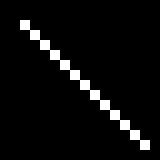
</td></tr>
</table>

## 3.5. Oval

<table>
<tr><td><pre>
> pico.init(true)
> pico.output.clear()
> pico.output.draw.oval({'!', x=8, y=8, w=10, h=6, anc='C'})
</pre>
</td><td>
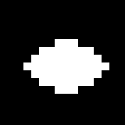
</td></tr>
</table>

## 3.6. Triangle

<table>
<tr><td><pre>
> pico.init(true)
> pico.output.clear()
> pico.output.draw.tri(
>>     {'!', x=8,  y=2},
>>     {'!', x=2,  y=14},
>>     {'!', x=14, y=14}
>> )
</pre>
</td><td>
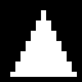
</td></tr>
</table>

## 3.7. Text

<table>
<tr><td><pre>
> pico.init(true)
> pico.output.clear()
> pico.output.draw.text("Hi", {'%', x=0.5, y=0.5, w=0.5, h=0.3, anc='C'})
</pre>
</td><td>
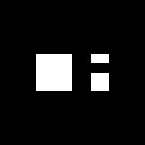
</td></tr>
</table>

## 3.8. Colors

<table>
<tr><td><pre>
> pico.init(true)
> pico.output.clear()
> pico.set.color.draw('red')
> pico.output.draw.rect({'!', x=1, y=1, w=4, h=4, anc='NW'})
> pico.set.color.draw('green')
> pico.output.draw.rect({'!', x=6, y=1, w=4, h=4, anc='NW'})
> pico.set.color.draw('blue')
> pico.output.draw.rect({'!', x=11, y=1, w=4, h=4, anc='NW'})
> -- ... more colors
</pre>
</td><td>
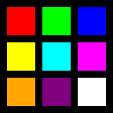
</td></tr>
</table>

Colors can be specified as:

- Named strings: `'red'`, `'green'`, `'blue'`, `'white'`, `'black'`, `'yellow'`,
  `'cyan'`, `'magenta'`, `'orange'`, `'purple'`, `'pink'`, `'gray'`
- RGB arguments: `pico.set.color.draw(255, 0, 0)`
- RGB table: `pico.set.color.draw({r=255, g=0, b=0})`

## 3.9. Alpha

<table>
<tr><td><pre>
> pico.init(true)
> pico.output.clear()
> pico.set.color.draw('red')
> pico.output.draw.rect({'!', x=2, y=4, w=8, h=8, anc='NW'})
> pico.set.color.draw('blue')
> pico.set.alpha(128)
> pico.output.draw.rect({'!', x=6, y=4, w=8, h=8, anc='NW'})
</pre>
</td><td>
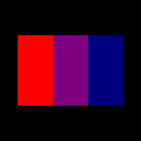
</td></tr>
</table>

Alpha ranges from 0 (transparent) to 255 (opaque). Default is 255.

## 3.10. Style

<table>
<tr><td><pre>
> pico.init(true)
> pico.output.clear()
> pico.set.style('fill')
> pico.output.draw.rect({'!', x=2, y=4, w=5, h=8, anc='NW'})
> pico.set.style('stroke')
> pico.output.draw.rect({'!', x=9, y=4, w=5, h=8, anc='NW'})
</pre>
</td><td>
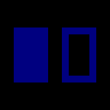
</td></tr>
</table>

Style is either `'fill'` (solid) or `'stroke'` (outline only).

# 4. Positioning: Mode & Anchor

Position and rectangle tables have a **mode** as the first element:

- `'!'` - Raw mode: logical pixel coordinates
- `'%'` - Percentage mode: normalized 0.0 to 1.0
- `'#'` - Tile mode: 1-indexed grid coordinates

## 4.1. Raw Mode (`'!'`)

<table>
<tr><td><pre>
> pico.init(true)
> pico.output.clear()
> pico.output.draw.rect({'!', x=2, y=2, w=6, h=6, anc='NW'})
</pre>
</td><td>
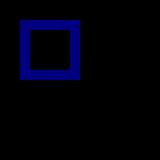
</td></tr>
</table>

Coordinates are in logical pixels (the world coordinate space).

## 4.2. Percentage Mode (`'%'`)

<table>
<tr><td><pre>
> pico.init(true)
> pico.output.clear()
> pico.output.draw.rect({'%', x=0.5, y=0.5, w=0.4, h=0.4, anc='C'})
</pre>
</td><td>
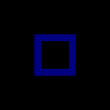
</td></tr>
</table>

Coordinates are normalized: `0.0` is the left/top edge, `1.0` is the
right/bottom edge.

## 4.3. Anchors

The `anc` field defines the reference point within the shape:

<table>
<tr><td><pre>
NW  N  NE
 W  C  E
SW  S  SE
</pre>
</td><td>
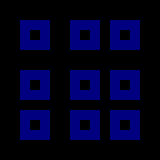
</td></tr>
</table>

Each rectangle above is positioned at the same relative location but with
different anchors.

## 4.4. Anchor Effect

<table>
<tr><td><pre>
> pico.init(true)
> pico.output.clear()
> -- gray dot marks (0.5, 0.5)
> pico.set.color.draw('gray')
> pico.output.draw.pixel({'%', x=0.5, y=0.5})
> -- red: NW anchor (top-left at point)
> pico.set.color.draw('red')
> pico.output.draw.rect({'%', x=0.5, y=0.5, w=0.3, h=0.3, anc='NW'})
> -- green: C anchor (center at point)
> pico.set.color.draw('green')
> pico.output.draw.rect({'%', x=0.5, y=0.5, w=0.3, h=0.3, anc='C'})
> -- blue: SE anchor (bottom-right at point)
> pico.set.color.draw('blue')
> pico.output.draw.rect({'%', x=0.5, y=0.5, w=0.3, h=0.3, anc='SE'})
</pre>
</td><td>
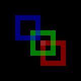
</td></tr>
</table>

All three rectangles have the same position `(0.5, 0.5)`, but different anchors
place them differently relative to that point.

## 4.5. Hierarchical Positioning

The `up` field references a parent rectangle for relative positioning:

<table>
<tr><td><pre>
> pico.init(true)
> pico.output.clear()
> local parent = {'%', x=0.5, y=0.5, w=0.6, h=0.6, anc='C'}
> pico.set.color.draw('gray')
> pico.output.draw.rect(parent)
> pico.set.color.draw('white')
> pico.output.draw.rect({
>>     '%', x=0.5, y=0.5, w=0.5, h=0.5, anc='C', up=parent
>> })
</pre>
</td><td>
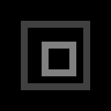
</td></tr>
</table>

The white rectangle is centered within the gray parent rectangle, not the
screen.

## 4.6. Tile Mode (`'#'`)

Tile mode uses 1-indexed grid coordinates. Requires setting `tile` in the view:

<table>
<tr><td><pre>
> pico.init(true)
> pico.set.view {
>>     window = {'!', w=160, h=160},
>>     world  = {'#', w=4, h=4},
>>     tile   = {w=4, h=4},
>> }
> pico.output.clear()
> pico.output.draw.rect({'#', x=1, y=1, w=1, h=1, anc='NW'})
> pico.output.draw.rect({'#', x=3, y=2, w=1, h=1, anc='NW'})
> pico.output.draw.rect({'#', x=2, y=4, w=2, h=1, anc='NW'})
</pre>
</td><td>
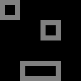
</td></tr>
</table>

The world is a 4x4 grid where each tile is 4x4 pixels.
Tile `(1,1)` is the top-left corner.

# 5. Advanced View

## 5.1. Zoom

When the world is smaller than the window, the view is zoomed in:

<table>
<tr><td><pre>
> pico.init(true)
> pico.set.view {
>>     window = {'!', w=160, h=160},
>>     world  = {'!', w=160, h=160},  -- 1:1
>> }
> pico.output.clear()
> pico.output.draw.rect({'!', x=40, y=40, w=80, h=80, anc='NW'})
</pre>
</td><td>

</td></tr>
</table>

<table>
<tr><td><pre>
> pico.init(true)
> pico.set.view {
>>     window = {'!', w=160, h=160},
>>     world  = {'!', w=80, h=80},  -- 2x zoom
>> }
> pico.output.clear()
> pico.output.draw.rect({'!', x=20, y=20, w=40, h=40, anc='NW'})
</pre>
</td><td>

</td></tr>
</table>

The same logical rectangle appears twice as large with 2x zoom.

## 5.2. Scrolling

The `source` parameter pans the view:

<table>
<tr><td><pre>
> pico.init(true)
> pico.set.view {
>>     window = {'!', w=160, h=160},
>>     world  = {'!', w=160, h=160},
>>     source = {'!', x=40, y=40, w=160, h=160},
>> }
> pico.output.clear()
> pico.output.draw.rect({'!', x=40, y=40, w=80, h=80, anc='NW'})
</pre>
</td><td>

</td></tr>
</table>

The view is scrolled by (40, 40), so the rectangle appears at the top-left.

## 5.3. Crop

The `pico.set.crop()` function limits drawing to a region:

<table>
<tr><td><pre>
> pico.init(true)
> pico.output.clear()
> pico.output.draw.rect({'%', x=0.5, y=0.5, w=0.8, h=0.8, anc='C'})
> pico.set.crop({'%', x=0.5, y=0.5, w=0.5, h=0.5, anc='C'})
> pico.set.color.draw('red')
> pico.output.draw.rect({'%', x=0.5, y=0.5, w=0.6, h=0.6, anc='C'})
</pre>
</td><td>
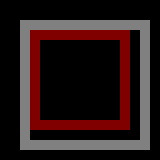
</td></tr>
</table>

The red rectangle is clipped to the crop region.

# 6. Events

## 6.1. Delay

The `pico.input.delay(ms)` function pauses execution:

<table>
<tr><td><pre>
> pico.init(true)
> pico.output.clear()
> pico.output.draw.pixel({'!', x=4, y=8})
</pre>
</td><td>
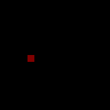
</td></tr>
</table>

<table>
<tr><td><pre>
> pico.input.delay(500)  -- wait 500ms
> pico.output.draw.pixel({'!', x=8, y=8})
</pre>
</td><td>
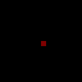
</td></tr>
</table>

<table>
<tr><td><pre>
> pico.input.delay(500)  -- wait 500ms
> pico.output.draw.pixel({'!', x=12, y=8})
</pre>
</td><td>
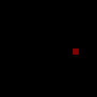
</td></tr>
</table>

## 6.2. Event Loop

The `pico.input.event()` function waits for input events:

```lua
pico.init(true)
while true do
    local e = pico.input.event()
    if e.tag == 'quit' then
        break
    elseif e.tag == 'key.dn' then
        print("Key pressed: " .. e.key)
    elseif e.tag == 'mouse.button.dn' then
        print("Mouse clicked at: " .. e.x .. ", " .. e.y)
    end
end
pico.init(false)
```

**Event types:**

- `{tag='quit'}` - Window close requested
- `{tag='key.dn', key='a'}` - Key pressed
- `{tag='key.up', key='a'}` - Key released
- `{tag='mouse.button.dn', '!', x=10, y=20, but='left'}` - Mouse button pressed
- `{tag='mouse.button.up', '!', x=10, y=20, but='left'}` - Mouse button released
- `{tag='mouse.motion', '!', x=10, y=20}` - Mouse moved

**Filtering:**

```lua
local e = pico.input.event('key.dn')          -- wait for key press only
local e = pico.input.event('key.dn', 1000)    -- wait up to 1000ms
```

## 6.3. Mouse Polling

The `pico.get.mouse(pos)` function updates a position table with current mouse
coordinates:

```lua
local pos = {'!', x=0, y=0}         -- raw mode
pico.get.mouse(pos)
print(pos.x, pos.y)

local pos = {'%', x=0, y=0}         -- percentage mode
pico.get.mouse(pos)
print(pos.x, pos.y)                 -- values between 0.0 and 1.0

local pos = {'#', x=0, y=0}         -- tile mode
pico.get.mouse(pos)
print(pos.x, pos.y)                 -- 1-indexed tile coordinates
```

## 6.4. Quit

The `pico.quit()` function pushes a quit event:

```lua
pico.quit()  -- will cause pico.input.event() to return {tag='quit'}
```

# 7. Expert Mode

By default, pico-lua uses immediate mode: every draw operation is visible
instantly.
Expert mode disables this, requiring explicit `present()` calls.

<table>
<tr><td><pre>
> pico.init(true)
> pico.set.expert(true)
> pico.output.clear()
> pico.output.draw.rect({'!', x=4, y=4, w=8, h=8, anc='NW'})
-- nothing visible yet
</pre>
</td><td>

</td></tr>
</table>

<table>
<tr><td><pre>
> pico.output.present()
-- now the rectangle is visible
</pre>
</td><td>
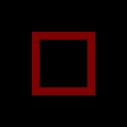
</td></tr>
</table>

Expert mode is useful for:

- Animation with controlled frame timing
- Complex scenes that should appear all at once
- Performance optimization (reduce flicker)

**Timing:**

```lua
pico.set.expert(true)
while true do
    local start = pico.get.ticks()
    -- draw frame
    pico.output.present()
    local elapsed = pico.get.ticks() - start
    if elapsed < 16 then
        pico.input.delay(16 - elapsed)  -- ~60 FPS
    end
end
```
