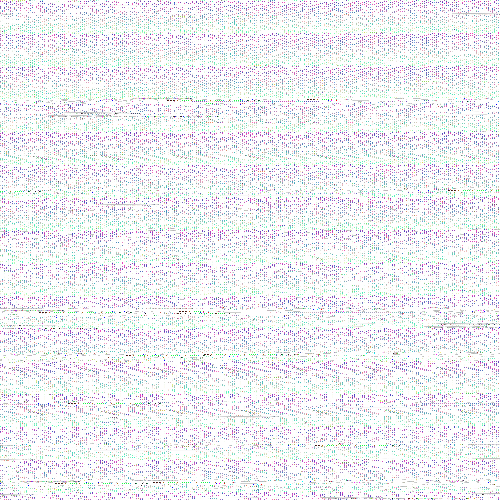
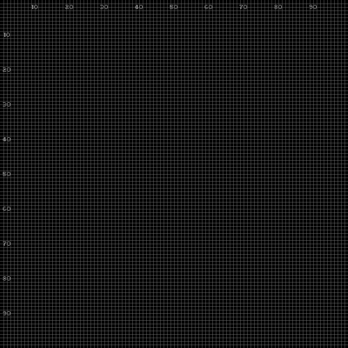
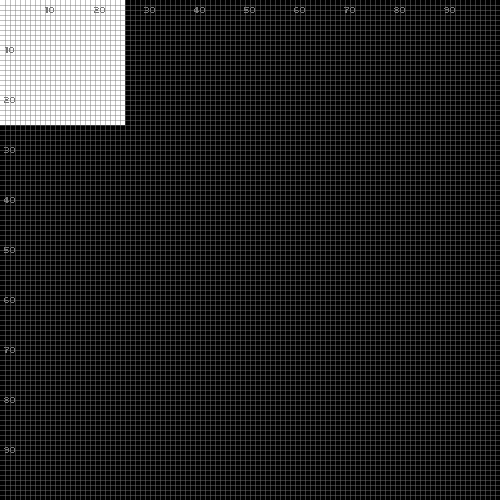
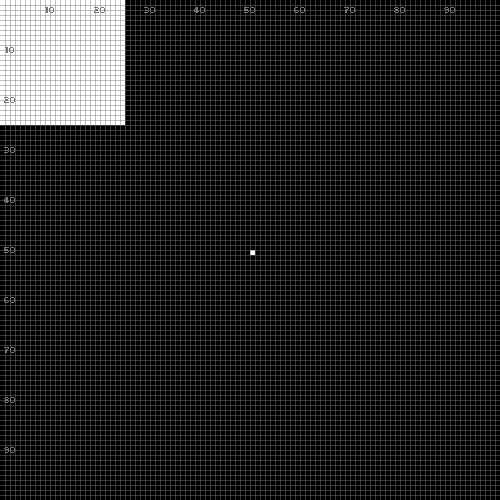
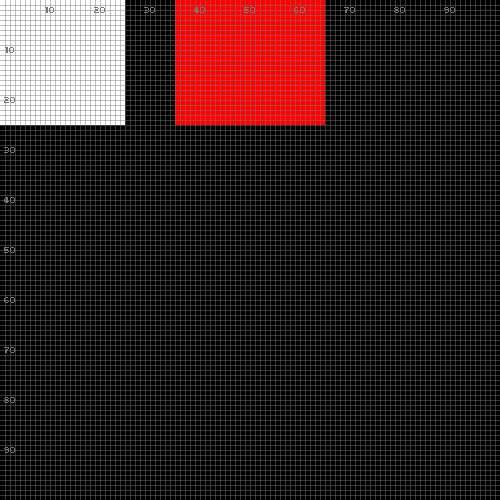
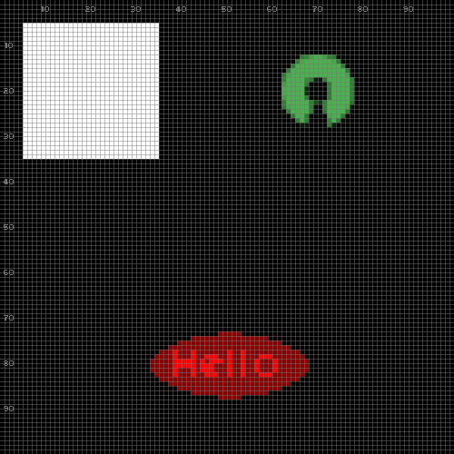
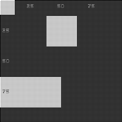

# Guide

1. [Introduction](#1-introduction)
2. [Initialization](#2-initialization)
3. [Basic Drawing](#3-basic-drawing)
4. [Positioning: Mode & Anchor](#4-positioning-mode--anchor)
5. [Advanced View](#5-advanced-view)
6. [Events](#6-events)
7. [Expert Mode](#7-expert-mode)

# 1. Introduction

`pico-lua` is a graphics library for 2D games and applications.
It is designed around 3 groups of APIs:

- `pico.output.*` for output operations,
    such as drawing shapes and playing audio.
- `pico.input.*` for input events,
    such as waiting time and key presses.
- `pico.get.*` and `pico.set.*` for the library state,
    such as the drawing color, and window title.

This guide is an interactive walkthrough of `pico-lua`.

From the command line, simply execute `pico-lua` with no parameters:

```bash
$ pico-lua
Lua 5.4.4  Copyright (C) 1994-2022 Lua.org, PUC-Rio
>
```

The Lua prompt `>` indicates that `pico-lua` is ready to receive commands.

<!--
**Basic Structure:**

Every pico-lua program follows this pattern:

```lua
pico.init(true)     -- initialize the library
-- ... drawing and input operations ...
pico.init(false)    -- finalize the library
```

**Internal State:**

The library maintains global state including:

- Colors (draw and clear)
- Alpha transparency
- Drawing style (fill or stroke)
- View configuration (window size, world size, zoom)
-->

# 2. Initialization

To initialize `pico-lua`, we call `pico.init(true)`:

<table>
<tr><td><pre>
> pico.init(true)
</pre>
</td><td>

</td></tr>
</table>

We immediately see a `500x500` window divided in `100x100` small rectangles
representing logical pixels.

By default, `pico-lua` conventionally exhibit a grid and coordinate labels to
aid development with visual verification.

To change the window title, grid, and size, we call `pico.set.view`:

<table>
<tr><td><pre>
> pico.set.view {
    title  = "Hello!",              -- changes title
    grid   = false,                 -- disables grid
    window = {'!', w=200, h=200},   -- physical size
    world  = {'!', w=200, h=200},   -- logical size
  }
</pre>
</td><td>

</td></tr>
</table>

Now the window title is set, the grid is disabled, and the window and world
sizes are the same (`200x200`).
The character `'!'` indicates a dimension in "raw mode", which we discuss
further.

In the end, we call `pico.init(false)` to terminate `pico-lua`:

<table>
<tr><td><pre>
> pico.init(false)
</pre>
</td><td>

</td></tr>
</table>

Then, we can restart `pico-lua` by calling `pico.init(true)` again:

<table>
<tr><td><pre>
> pico.init(true)
</pre>
</td><td>

</td></tr>
</table>

We can see that the title, grid, and sizes are now reset to default.

# 3. Basic Drawing

Drawing operations appear immediately on screen (single-buffer rendering).

To clear the screen, we call `pico.output.clear`:

<table>
<tr><td><pre>
> pico.output.clear()
</pre>
</td><td>

</td></tr>
</table>

To draw a rectangle, we call `pico.output.draw.rect`:

<table>
<tr><td><pre>
> pico.output.draw.rect({'!', x=10, y=10, w=30, h=30})
</pre>
</td><td>

</td></tr>
</table>

The table `{'!', x=10, y=10, w=30, h=30}` specifies a rectangle at position
`(10,10)` with size `30x30`.
The character `'!'` indicates "raw mode", meaning coordinates are in logical
pixels.

To change the drawing color, we call `pico.set.color.draw`:

<table>
<tr><td><pre>
> pico.set.color.draw('red')
> pico.output.draw.rect({'!', x=50, y=10, w=30, h=30})
</pre>
</td><td>

</td></tr>
</table>

Colors can be named strings (`'red'`, `'green'`, `'blue'`, `'white'`, etc.),
RGB arguments (`255, 0, 0`), or RGB tables (`{r=255, g=0, b=0}`).

Other drawing operations include `draw.pixel`, `draw.line`, `draw.oval`,
`draw.tri`, `draw.text`, and `draw.image`.

# 4. Positioning: Mode & Anchor

Position and rectangle tables have a **mode** as the first element:

- `'!'` - Raw mode: logical pixel coordinates
- `'%'` - Percentage mode: normalized 0.0 to 1.0
- `'#'` - Tile mode: 1-indexed grid coordinates

We already used raw mode in the previous section.
Now let's try percentage mode:

<table>
<tr><td><pre>
> pico.init(true)
> pico.output.clear()
> pico.output.draw.rect({'%', x=0.5, y=0.5, w=0.5, h=0.5, anc='C'})
</pre>
</td><td>

</td></tr>
</table>

The rectangle is centered at `(0.5, 0.5)` with size `50%x50%` of the screen.
The `anc='C'` means the center of the rectangle is at the given position.

Anchors define the reference point within the shape:

```
NW   N   NE
 W   C   E
SW   S   SE
```

Let's see how the same position with different anchors affects placement:

<table>
<tr><td><pre>
> pico.output.clear()
> pico.set.color.draw('red')
> pico.output.draw.rect({'%', x=0.5, y=0.5, w=0.3, h=0.3, anc='NW'})
> pico.set.color.draw('green')
> pico.output.draw.rect({'%', x=0.5, y=0.5, w=0.3, h=0.3, anc='C'})
> pico.set.color.draw('blue')
> pico.output.draw.rect({'%', x=0.5, y=0.5, w=0.3, h=0.3, anc='SE'})
</pre>
</td><td>

</td></tr>
</table>

All three rectangles have position `(0.5, 0.5)`, but different anchors place
them differently relative to that point.

For tile-based games, we can use tile mode with 1-indexed coordinates:

<table>
<tr><td><pre>
> pico.init(true)
> pico.set.view {
    window = {'!', w=200, h=200},
    world  = {'#', w=4, h=4},
    tile   = {w=25, h=25},
  }
> pico.output.clear()
> pico.output.draw.rect({'#', x=1, y=1, w=1, h=1})
> pico.output.draw.rect({'#', x=3, y=2, w=1, h=1})
> pico.output.draw.rect({'#', x=2, y=4, w=2, h=1})
</pre>
</td><td>

</td></tr>
</table>

The world is a 4x4 grid where each tile is 25x25 pixels.
Tile `(1,1)` is the top-left corner.

# 5. Advanced View

When the world is smaller than the window, the view is zoomed in.
Let's compare 1:1 and 2x zoom:

<table>
<tr><td><pre>
> pico.init(true)
> pico.set.view {
    window = {'!', w=200, h=200},
    world  = {'!', w=200, h=200},  -- 1:1
  }
> pico.output.clear()
> pico.output.draw.rect({'!', x=50, y=50, w=100, h=100})
</pre>
</td><td>

</td></tr>
</table>

<table>
<tr><td><pre>
> pico.set.view {
    world  = {'!', w=100, h=100},  -- 2x zoom
  }
</pre>
</td><td>

</td></tr>
</table>

The same logical rectangle appears twice as large with 2x zoom.

The `source` parameter pans the view:

<table>
<tr><td><pre>
> pico.set.view {
    world  = {'!', w=200, h=200},
    source = {'!', x=50, y=50, w=200, h=200},
  }
</pre>
</td><td>

</td></tr>
</table>

The view is scrolled by `(50, 50)`, so the rectangle appears at the top-left.

# 6. Events

The `pico.input.delay(ms)` function pauses execution for a given time:

<table>
<tr><td><pre>
> pico.init(true)
> pico.output.clear()
> pico.output.draw.pixel({'!', x=25, y=50})
> pico.input.delay(500)
> pico.output.draw.pixel({'!', x=50, y=50})
> pico.input.delay(500)
> pico.output.draw.pixel({'!', x=75, y=50})
</pre>
</td><td>

</td></tr>
</table>

The `pico.input.event()` function waits for input events:

```lua
> while true do
    local e = pico.input.event()
    if e.tag == 'quit' then
        break
    elseif e.tag == 'key.dn' then
        print("Key pressed: " .. e.key)
    end
  end
```

Event types include `'quit'`, `'key.dn'`, `'key.up'`, `'mouse.button.dn'`,
`'mouse.button.up'`, and `'mouse.motion'`.

We can also filter events and set timeouts:

```lua
> local e = pico.input.event('key.dn')        -- wait for key press only
> local e = pico.input.event('key.dn', 1000)  -- wait up to 1000ms
```

The `pico.get.mouse(pos)` function polls the current mouse position:

```lua
> local pos = {'!', x=0, y=0}
> pico.get.mouse(pos)
> print(pos.x, pos.y)
```

# 7. Expert Mode

By default, `pico-lua` uses immediate mode: every draw operation is visible
instantly.
Expert mode disables this, requiring explicit `present()` calls.

<table>
<tr><td><pre>
> pico.init(true)
> pico.set.expert(true)
> pico.output.clear()
> pico.output.draw.rect({'!', x=25, y=25, w=50, h=50})
</pre>
</td><td>

</td></tr>
</table>

Nothing is visible yet because we haven't called `present()`.

<table>
<tr><td><pre>
> pico.output.present()
</pre>
</td><td>

</td></tr>
</table>

Now the rectangle is visible.

Expert mode is useful for animation with controlled frame timing:

```lua
> pico.set.expert(true)
> while true do
    local start = pico.get.ticks()
    -- draw frame here
    pico.output.present()
    local elapsed = pico.get.ticks() - start
    if elapsed < 16 then
        pico.input.delay(16 - elapsed)  -- ~60 FPS
    end
  end
```
