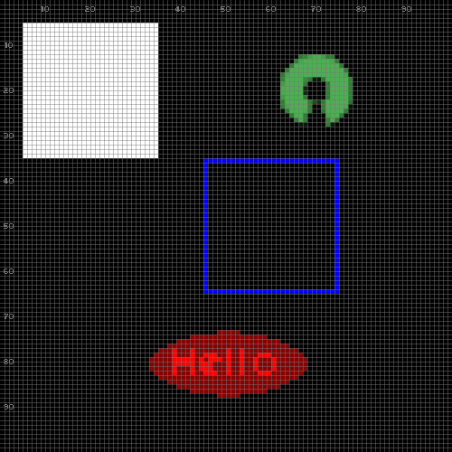
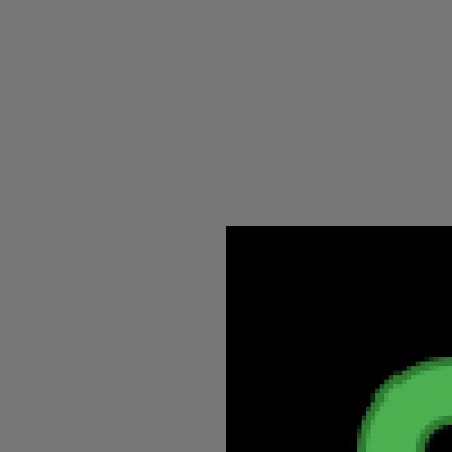
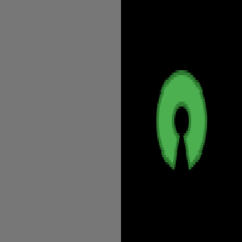
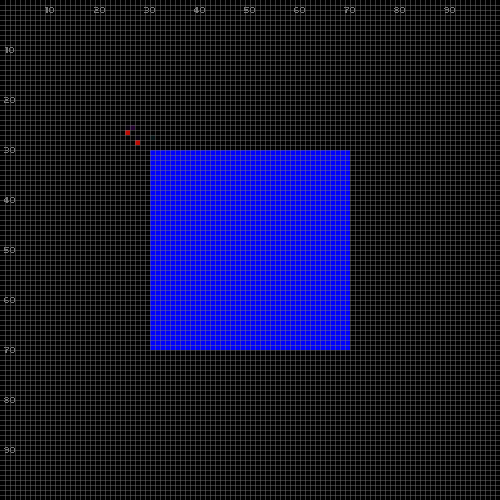

# Guide

1. [Introduction](#1-introduction)
2. [Initialization](#2-initialization)
3. [Basic Drawing](#3-basic-drawing)
4. [Internal State](#4-internal-state)
5. [Positioning: Mode & Anchor](#5-positioning-mode--anchor)
6. [Advanced View](#6-advanced-view)
7. [Events](#7-events)
8. [Layers](#8-layers)
9. [Expert Mode](#9-expert-mode)
10. [Auxiliary Functions](#10-auxiliary-functions)
11. [Extras](#11-extras)

## 1. Introduction

`pico-lua` is a graphics library for 2D games and applications.
It is designed around 3 groups of APIs:

- `pico.output.*` for output operations,
    such as drawing shapes and playing audio.
- `pico.input.*` for input events,
    such as waiting time and key presses.
- `pico.get.*` and `pico.set.*` for the library state,
    such as the drawing color, and window title.

This guide is an interactive walk-through of `pico-lua`.
It is not meant to be exhaustive: consult the [API](api.md) for completeness.

From the command line, simply execute `pico-lua` with no parameters:

```bash
$ pico-lua
Lua 5.4.4  Copyright (C) 1994-2022 Lua.org, PUC-Rio
>
```

The Lua prompt `>` indicates that `pico-lua` is ready to receive commands.

## 2. Initialization

### 2.1. Open

To initialize `pico-lua`, we pass `true` to `pico.init`:

<table>
<tr><td><pre>
> pico.init(true)
</pre>
</td><td>

</td></tr>
</table>

We immediately see a `500x500` window divided in `100x100` small rectangles
representing logical pixels.

By default, `pico-lua` conventionally exhibit a grid and coordinate labels to
aid development with visual inspection.
You may click in the image to zoom in.

### 2.2. Configure

To change the window title, grid, and size, we call `pico.set.view`:

<table>
<tr><td><pre>
> pico.set.view {
    title  = "Hello!",            -- changes title
    grid   = false,               -- disables grid
    window = {'!', w=200, h=200}, -- physical size
    world  = {'!', w=200, h=200}, -- logical size
  }
</pre>
</td><td>

</td></tr>
</table>

Now the window title is set, the grid is disabled, and the window and world
sizes are the same.
The character `'!'` indicates a dimension in "raw mode", which we discuss
further.

### 2.3. Close

In the end, we pass `false` to `pico.init` to properly finalize `pico-lua`:

<table>
<tr><td><pre>
> pico.init(false)
</pre>
</td><td>
(no image)
</td></tr>
</table>

Then, we can restart `pico-lua` by calling `pico.init(true)` again:

<table>
<tr><td><pre>
> pico.init(true)
</pre>
</td><td>

</td></tr>
</table>

We can see that the title, grid, and sizes are now reset to default.

## 3. Basic Drawing

In `pico-lua`, drawing operations have immediate effect.
It simulates single-buffer rendering to ease prototyping.

### 3.1. Pixel

To draw a single pixel, we call `pico.output.draw.pixel`:

<table>
<tr><td><pre>
> pico.output.draw.pixel {'!', x=50, y=50}
</pre>
</td><td>

</td></tr>
</table>

The pixel occupies a physical `5x5` square representing a single logical pixel,
as expected.

### 3.2. Clear

To clear the screen, we call `pico.output.clear`:

<table>
<tr><td><pre>
> pico.output.clear()
</pre>
</td><td>

</td></tr>
</table>

The pixel is gone.

### 3.3. Rectangle

To draw a rectangle, we call `pico.output.draw.rect`:

<table>
<tr><td><pre>
> pico.output.draw.rect {'!', x=20, y=20, w=30, h=30}
</pre>
</td><td>

</td></tr>
</table>

The table specifies a rectangle at position `(20,20)` with size `30x30`.

Unlike most graphics libraries, by default `pico-lua` centers the rectangle at
the given position.
We discuss positioning and anchoring further.

### 3.4. Image

To draw an image, we call `pico.output.draw.image`:

<table>
<tr><td><pre>
> pico.output.draw.image('img/open.png', {'!', x=70, y=20, w=20, h=20})
</pre>
</td><td>

</td></tr>
</table>

Other drawing operations include `draw.line`, `draw.polygon`, and `draw.text`.

## 4. Internal State

`pico-lua` keeps an internal state that affects drawing operations, such as
the current color, alpha transparency, and drawing style.

### 4.1. Color

To change the drawing color state, we call `pico.set.color.draw`:

<table>
<tr><td><pre>
> pico.set.color.draw 'red'
> pico.output.draw.text("Hello", {'!', x=50, y=80, h=10})
</pre>
</td><td>

</td></tr>
</table>

The text appears in red, centered at the given position.

Note that `pico-lua` handles the text width automatically, preserving the
correct aspect ratio.

Colors can also be specified as tables with RGB values:

```lua
> pico.set.color.draw {r=128, g=0xFF, b=200}       -- absolute (0-255), (0x00-0xFF)
> pico.set.color.draw {'%', r=0.5, g=0.25, b=0.8}  -- percentage (0.0-1.0)
```

### 4.2. Transparency

We may also change the drawing transparency:

<table>
<tr><td><pre>
> pico.set.alpha(0x88)
> pico.output.draw.oval {'!', x=50, y=80, w=35, h=15}
</pre>
</td><td>

</td></tr>
</table>

The oval appears on top of the text, but the transparency keeps the text
visible.

### 4.3. All-at-Once

We can set multiple state values at once using `pico.set` as a function:

<table>
<tr><td><pre>
> pico.set {
    alpha = 0xFF,
    color = { draw = 'blue' },
    style = 'stroke',
  }
> pico.output.draw.rect {'!', x=50, y=50, w=30, h=30}
</pre>
</td><td>

</td></tr>
</table>

### 4.4. Push/Pop

To temporarily change state and restore it later, use `pico.push` and
`pico.pop`:

<table>
<tr><td><pre>
> pico.output.clear()
> pico.set.color.draw 'white'
> pico.output.draw.rect {'!', x=25, y=50, w=20, h=20}
> pico.push()
> pico.set.color.draw 'red'
> pico.output.draw.rect {'!', x=50, y=50, w=20, h=20}
> pico.pop()
> pico.output.draw.rect {'!', x=75, y=50, w=20, h=20}
</pre>
</td><td>

</td></tr>
</table>

The first and third rectangles are white (original color), while the middle one
is red (temporary color between push/pop).

## 5. Positioning: Mode & Anchor

`pico-lua` supports positioning modes as follows:

- `'!'`: Raw: logical pixel coordinates
- `'%'`: Percentage: coordinates relative to the world size (from `0.0` to `1.0`)
- `'#'`: Tile: grid coordinates based on a tile dimension

The mode must be set at index `1` for tables representing positions,
dimensions, and rectangles.

### 5.1. Percentages

Since we already used the raw mode in previous sections, let's now try
percentages:

<table>
<tr><td><pre>
> pico.output.clear()
> pico.output.draw.rect {'%', x=0.5, y=0.5, w=0.5, h=0.5}
</pre>
</td><td>

</td></tr>
</table>

The rectangle is centered at `(0.5,0.5)`, or half, of the screen.

### 5.2. Anchors

In addition to positioning mode, `pico-lua` also supports anchoring, which
determines the reference point within a shape:

<table>
<tr><td><pre>
> pico.output.clear()
> pico.set.color.draw 'white'
> pico.output.draw.pixel {'%', x=0.5, y=0.5}
> pico.set.color.draw 'red'
> pico.output.draw.rect {'%', x=0.5, y=0.5, w=0.3, h=0.3, anchor='NW'}
> pico.set.color.draw 'green'
> pico.output.draw.rect {'%', x=0.5, y=0.5, w=0.3, h=0.3, anchor='C'}
> pico.set.color.draw 'blue'
> pico.output.draw.rect {'%', x=0.5, y=0.5, w=0.3, h=0.3, anchor='SE'}
</pre>
</td><td>

</td></tr>
</table>

We draw all three rectangles at the same pixel position, but with different
anchors.

The anchor determines a position inside the object, which should be fixed at
the given drawing point:

```
+-----------+
|NW   N   NE|
| W   C   E |
|SW   S   SE|
+-----------+
```

By default, `pico-lua` uses the center anchor.

### 5.3. Tiles

The tile mode `'#'` uses discrete sized blocks as references for positions and
dimensions:

<table>
<tr><td><pre>
> pico.init(true)
> pico.set.view {
    window = {'#', w=40, h=40},
    world  = {'#', w=5, h=5},
    tile   = {w=20, h=20},
  }
> pico.output.clear()
> pico.output.draw.rect {'#', x=3, y=3, w=1, h=1}
> pico.output.draw.rect {'#', x=5, y=1, w=2, h=1, anchor='NE'}
</pre>
</td><td>

</td></tr>
</table>

In the example, we set each tile to `20x20` and create a world of `5x5` tiles.
Note that the window can also be specified in tiles.

We draw two rectangles also using the tile mode `'#'`:
The first is centered at `(3,3)` occupying `1x1`.
The second uses anchor `NE`, to properly occupy the top right of the screen
with `2x1`.

## 6. Advanced View

The view controls how the logical world maps to the physical window.

By default, `pico-lua` provides key bindings to zoom and scroll the view:

- `CTRL` / `+`,`-`: zoom in / out
- `CTRL` / Arrow keys: scroll the view

### 6.1. Key Bindings

Let's draw a centered image and use the key bindings to explore it:

<table>
<tr><td><pre>
> pico.init(true)
> pico.set.view {
    window = {'!', w=200, h=200},
    world  = {'!', w=200, h=200},
  }
> pico.output.clear()
> pico.output.draw.image('img/open.png', {'%', x=0.5, y=0.5, w=0.5, h=0.5})
</pre>
</td><td>

</td></tr>
</table>

Now try pressing `+` to zoom in, then use the arrow keys to scroll around.
Press `-` to zoom back out.

### 6.2. Zoom

The zoom level is controlled by the ratio between `window` and `world` sizes:

<table>
<tr><td><pre>
> pico.set.view {
    world  = {'!', w=100, h=100},  -- 2x zoom
  }
</pre>
</td><td>

</td></tr>
</table>

A smaller world means more zoom: 200x200 window with 100x100 world = 2x zoom.

### 6.3. Scroll

The `source` parameter scrolls the view:

<table>
<tr><td><pre>
> pico.set.view {
    world  = {'!', w=200, h=200},
    source = {'!', x=50, y=50, w=200, h=200},
  }
</pre>
</td><td>

</td></tr>
</table>

The view is scrolled by `(50, 50)`, so the image appears offset.

### 6.4. Size

The `size` shorthand sets both `window` and `world` to the same dimensions:

```lua
> pico.set.view {
    size = {'!', w=200, h=200},
  }
```

This is equivalent to setting `window` and `world` separately:

```lua
> pico.set.view {
    window = {'!', w=200, h=200},
    world  = {'!', w=200, h=200},
  }
```

### 6.5. Target

The `target` parameter controls where on the physical window the world is
rendered:

```lua
> pico.set.view {
    target = {'%', x=0.75, y=0.5, w=0.5, h=1.0},
  }
```

The logical world is rendered on the right half of the window.

### 6.6. Clip

The `clip` parameter restricts drawing to a sub-region of the world:

```lua
> pico.set.view {
    clip = {'%', x=0.5, y=0.5, w=0.5, h=0.5},
  }
```

Only drawing operations within the clip region are visible.

### 6.7. Fullscreen

To enter fullscreen mode:

```lua
> pico.set.view { fullscreen = true }
```

## 7. Events

`pico-lua` provides functions to handle time and user input.

### 7.1. Delay

The `pico.input.delay(ms)` function pauses execution for a given time:

<table>
<tr><td><pre>
> pico.init(true)
> pico.output.clear()
> pico.output.draw.pixel {'!', x=25, y=50}
> pico.input.delay(500)
> pico.output.draw.pixel {'!', x=50, y=50}
> pico.input.delay(500)
> pico.output.draw.pixel {'!', x=75, y=50}
</pre>
</td><td>

</td></tr>
</table>

### 7.2. Event

The `pico.input.event()` function waits for input events:

```lua
> while true do
    local e = pico.input.event()
    if e.tag == 'quit' then
        break
    elseif e.tag == 'key.dn' then
        print("Key pressed: " .. e.key)
    end
  end
```

Event types include `'quit'`, `'key.dn'`, `'key.up'`, `'mouse.button.dn'`,
`'mouse.button.up'`, and `'mouse.motion'`.

We can also filter events and set timeouts:

```lua
> local e = pico.input.event('key.dn')        -- wait for key press only
> local e = pico.input.event('key.dn', 1000)  -- wait up to 1000ms
```

Mouse events include position and button fields:

```lua
> local e = pico.input.event('mouse.button.dn')
> print(e.x, e.y, e.but)   -- position and button
```

When a timeout expires without an event, `nil` is returned:

```lua
> local e = pico.input.event('key.dn', 1000)
> print(e)   -- nil (if no key pressed within 1000ms)
```

### 7.3. Mouse

The `pico.get.mouse(pos)` function polls the current mouse position:

```lua
> local pos = {'!', x=0, y=0}
> local pressed = pico.get.mouse(pos, 1)  -- 1=left, 2=mid, 3=right
> print(pos.x, pos.y, pressed)
```

### 7.4. Quit

The `pico.quit()` function pushes a quit event, which can be caught by
`pico.input.event()`:

```lua
> pico.quit()
```

## 8. Layers

Layers are off-screen textures for compositing complex scenes.

### 8.1. Creating Layers

```lua
> pico.init(true)
> pico.layer.empty("bg", {w=100, h=100})
> pico.set.layer("bg")
> pico.set.color.draw 'blue'
> pico.output.draw.rect {'%', x=0.5, y=0.5, w=0.8, h=0.8}
```

### 8.2. Compositing

<table>
<tr><td><pre>
> pico.set.layer(nil)  -- back to main
> pico.output.clear()
> pico.output.draw.layer("bg", {'%', x=0.5, y=0.5, w=0.5, h=0.5})
</pre>
</td><td>

</td></tr>
</table>

Layers can be created from images (`pico.layer.image`), text
(`pico.layer.text`), or pixel buffers (`pico.layer.buffer`).

## 9. Expert Mode

By default, `pico-lua` uses immediate mode: every draw operation is visible
instantly.
Expert mode disables this, requiring explicit `present()` calls.

### 9.1. Buffered

To enable expert mode, we call `pico.set.expert(true)`:

<table>
<tr><td><pre>
> pico.init(true)
> pico.set.expert(true)
> pico.output.clear()
> pico.output.draw.rect {'!', x=25, y=25, w=50, h=50}
</pre>
</td><td>

</td></tr>
</table>

Nothing is visible yet because we haven't called `present()`.

<table>
<tr><td><pre>
> pico.output.present()
</pre>
</td><td>

</td></tr>
</table>

Now the rectangle is visible.

### 9.2. Animation

Expert mode is useful for animation with controlled frame timing:

```lua
> pico.set.expert(true)
> while true do
    local start = pico.get.ticks()
    -- draw frame here
    pico.output.present()
    local elapsed = pico.get.ticks() - start
    if elapsed < 16 then
        pico.input.delay(16 - elapsed)  -- ~60 FPS
    end
  end
```

## 10. Auxiliary Functions

`pico-lua` provides utility functions for coordinate conversion and collision
detection.

### 10.1. Coordinate Conversion

The `pico.cv` functions convert relative coordinates to absolute:

```lua
> pico.init(true)
> local pos = pico.cv.pos({'%', x=0.5, y=0.5})
> print(pos.x, pos.y)
50   50
```

```lua
> local rect = pico.cv.rect({'%', x=0.5, y=0.5, w=0.3, h=0.3, anchor='C'})
> print(rect.x, rect.y, rect.w, rect.h)
35   35   30   30
```

An optional `base` rectangle can serve as the reference frame:

```lua
> local base = {'!', x=0, y=0, w=50, h=50}
> local pos = pico.cv.pos({'%', x=0.5, y=0.5}, base)
> print(pos.x, pos.y)
25   25
```

### 10.2. Collision Detection

The `pico.vs` functions test for collisions:

```lua
> local r = {'!', x=50, y=50, w=20, h=20}
> local p = {'!', x=55, y=55}
> print(pico.vs.pos_rect(p, r))
true
```

```lua
> local r1 = {'!', x=50, y=50, w=20, h=20}
> local r2 = {'!', x=60, y=60, w=20, h=20}
> print(pico.vs.rect_rect(r1, r2))
true
```

## 11. Extras

### 11.1. Sound

To play a sound file:

```lua
> pico.output.sound('path/to/sound.wav')
```

### 11.2. Screenshot

To save a screenshot of the current window:

```lua
> pico.output.screenshot('my-screenshot.png')
```

An optional rectangle crops the screenshot:

```lua
> pico.output.screenshot('crop.png', {'!', x=10, y=10, w=50, h=50})
```
