# Guide

1. [Introduction](#1-introduction)
2. [Initialization](#2-initialization)
3. [Basic Drawing](#3-basic-drawing)
4. [Internal State](#4-internal-state)
5. [Positioning: Mode & Anchor](#5-positioning-mode--anchor)
6. [Advanced View](#6-advanced-view)
7. [Events](#7-events)
8. [Layers](#8-layers)
9. [Expert Mode](#9-expert-mode)
10. [Auxiliary Functions](#10-auxiliary-functions)
11. [Extras](#11-extras)

## 1. Introduction

`pico-lua` is a graphics library for 2D games and applications.
It is designed around 3 groups of APIs:

- `pico.output.*` for output operations,
    such as drawing shapes and playing audio.
- `pico.input.*` for input events,
    such as waiting time and key presses.
- `pico.get.*` and `pico.set.*` for the internal library state,
    such as current drawing color, and window dimensions.

This guide is an interactive walk-through of `pico-lua`.
It is not meant to be exhaustive.
Consult the [API](api.md) for completeness.

From the command line, simply execute `pico-lua` with no parameters:

```bash
$ pico-lua
Lua 5.4.4  Copyright (C) 1994-2022 Lua.org, PUC-Rio
>
```

The Lua prompt `>` indicates that `pico-lua` is ready to receive commands.

## 2. Initialization

### 2.1. Open

To initialize `pico-lua`, we pass `true` to `pico.init`:

<table>
<tr><td><pre>
> pico.init(true)
</pre>
</td><td>
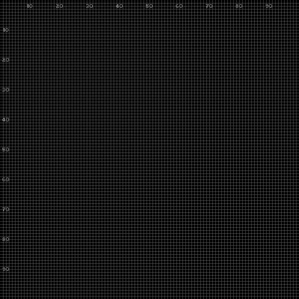
</td></tr>
</table>

We immediately see a `500x500` window divided in small `5x5` rectangles
representing `100x100` logical pixels.

In the context of `pico-lua`, we use the term **world** to designate the
logical view, which applications use as the main reference.

By default, `pico-lua` exhibits the grid and coordinate labels to aid
development through visual inspection.

### 2.2. Configure

To configure the window and the world view, we use `pico.set.window` and
`pico.set.view`:

<table>
<tr><td><pre>
> pico.set.window {
    title = "Hello!",
    dim   = { '!', w=200, h=200 },
  }
> pico.set.view {
    grid = false,
    dim  = { '!', w=200, h=200 },
  }
</pre>
</td><td>
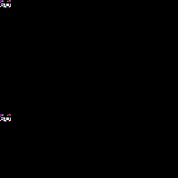
</td></tr>
</table>

After the two commands, the window title is set, the grid is disabled, and both
the window and view are set to the same dimensions.

The character `'!'` indicates a dimension in "raw mode", which we will discuss
in [#Positioning Mode](#5-positioning-mode--anchor).

You could also use the simpler `pico.set.dim` to set the window and view
dimensions at the same time:

<table>
<tr><td><pre>
> pico.set.dim { '!', w=200, h=200 }
</pre>
</td><td>

</td></tr>
</table>

*(The image is the same as before.)*

### 2.3. Close

In the end, we pass `false` to `pico.init` to properly finalize `pico-lua`:

<table>
<tr><td><pre>
> pico.init(false)
</pre>
</td><td>
*(no image)*
</td></tr>
</table>

Then, we can restart `pico-lua` by calling `pico.init(true)` again:

<table>
<tr><td><pre>
> pico.init(true)
</pre>
</td><td>

</td></tr>
</table>

We can see that the title, grid, and sizes are now reset to default.

## 3. Basic Drawing

To ease prototyping, drawing operations in `pico-lua` take immediate effect.

### 3.1. Pixel

To draw a single pixel, we call `pico.output.draw.pixel`:

<table>
<tr><td><pre>
> pico.output.draw.pixel { '!', x=50, y=50 }
</pre>
</td><td>
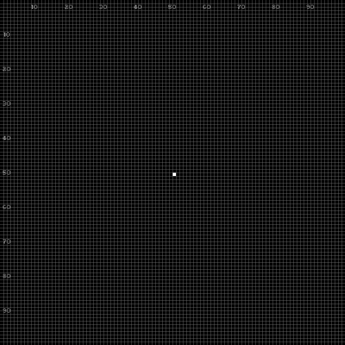
</td></tr>
</table>

The pixel occupies a physical `5x5` square representing a single world pixel,
as expected.

### 3.2. Clear

To clear the screen, we call `pico.output.clear`:

<table>
<tr><td><pre>
> pico.output.clear()
</pre>
</td><td>

</td></tr>
</table>

Now the pixel is gone.

### 3.3. Rectangle

To draw a rectangle, we call `pico.output.draw.rect`:

<table>
<tr><td><pre>
> pico.output.draw.rect { '!', x=20, y=20, w=30, h=30 }
</pre>
</td><td>

</td></tr>
</table>

The table specifies a rectangle at position `(20,20)` with size `30x30`.

With the aid of the tick marks, we can see that the rectangle centered at the
given position.
Unlike most graphics libraries, `pico-lua` **centers** objects by default,
which we will discuss in [#Anchors](#52-anchors).

### 3.4. Image

To draw an image, we call `pico.output.draw.image`:

<table>
<tr><td><pre>
> pico.output.draw.image('img/open.png', {'!', x=70, y=20, w=20, h=20})
</pre>
</td><td>
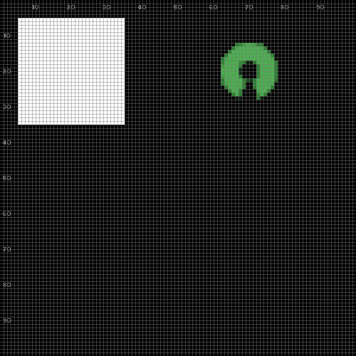
</td></tr>
</table>

*(You will need to save the [image](img/open.png) on your machine.)*

Note that `pico-lua` retains both objects on the screen.

Other drawing operations include `draw.line`, `draw.polygon`, and `draw.text`.

## 4. Graphics State

`pico-lua` keeps an internal graphics state that affects drawing operations,
such as the current color, transparency, and drawing style.

### 4.1. Color

To change the drawing color state, we call `pico.set.color.draw`:

<table>
<tr><td><pre>
> pico.set.color.draw 'red'
> pico.output.draw.text("Hello", {'!', x=50, y=80, h=10})
</pre>
</td><td>
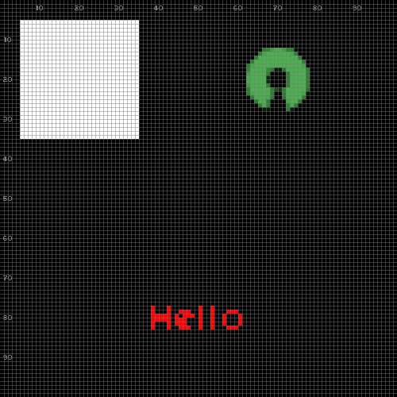
</td></tr>
</table>

A `set` has no immediate effect on the screen, and only affects further
operations.

Therefore, the text appears in red, centered at the given position.

Note `pico-lua` preserves the correct text aspect ratio if the width `w` is
omitted.

Colors can also be specified as tables with RGB values:

```lua
> pico.set.color.draw { r=128, g=0xFF, b=200 }      -- absolute (0-255), (0x00-0xFF)
> pico.set.color.draw { '%', r=0.5, g=0.25, b=0.8 } -- percentage mode '%' (0.0-1.0)
> pico.set.color.draw 'red'                         -- restore red (for the tutorial)
```

### 4.2. Transparency

We may also change the alpha transparency for further drawing operations:

<table>
<tr><td><pre>
> pico.set.alpha(0x88)
> pico.output.draw.oval { '!', x=50, y=80, w=35, h=15 }
</pre>
</td><td>
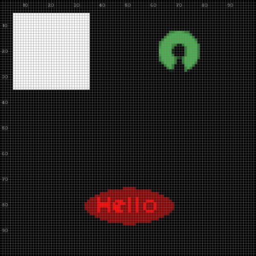
</td></tr>
</table>

The oval appears on top of the text, but the transparency keeps the text
visible.

Following the general convention for "alpha":
    0x00 is fully transparent, and
    0xFF is fully opaque.

### 4.3. All-at-Once

We can also set multiple state values at once using `pico.set` as a general
function:

<table>
<tr><td><pre>
> pico.set {
    alpha = 0xFF,
    color = { draw = 'blue' },
    style = 'stroke',
  }
> pico.output.draw.rect { '!', x=60, y=50, w=30, h=30 }
</pre>
</td><td>
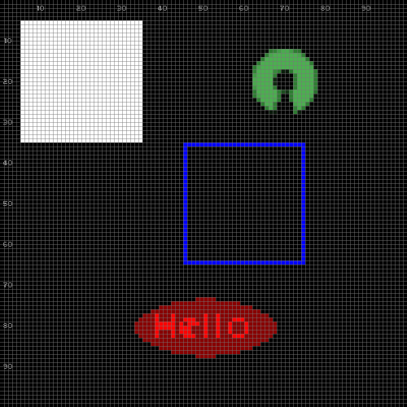
</td></tr>
</table>

## 5. Positioning: Mode & Anchor

`pico-lua` supports multiple positioning modes as follows:

- `'!'` - Raw: world pixel coordinates
            (from `0` to world `w/h`)
- `'%'` - Percentage: coordinates relative to world `w/h`
            (from `0.0` to `1.0`)
- `'#'` - Tile: grid coordinates based on tile and world `w/h`
            (from `0` to `w/h`)

Positioning modes appear at index `1` of tables representing positions,
dimensions, and rectangles:

- `{ '%', x=0.5, y=0.5 }`:          a centered relative position
- `{ '!', w=20, h=30 }`:            a raw dimension
- `{ '#', x=4, y=4, w=2, h=1 }`:    a rectangle covering 2 tiles horizontally

Let's restart `pico-lua` with some transparency:

<table>
<tr><td><pre>
> pico.init(false)
> pico.init(true)
> pico.set.alpha(0x88)
> pico.set.color.draw 'red'
</pre>
</td><td>

</td></tr>
</table>

### 5.1. Percentages

Percentages is the preferable mode for positioning:

<table>
<tr><td><pre>
> pico.output.draw.rect { '%', x=0.5, y=0.5, w=0.5, h=0.5 }
</pre>
</td><td>
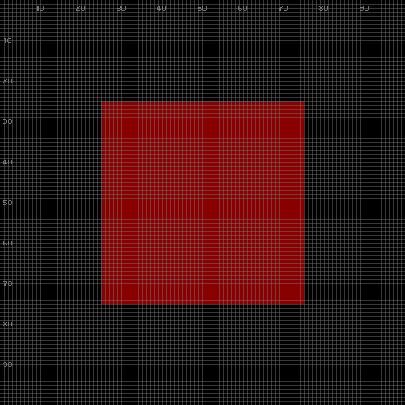
</td></tr>
</table>

The rectangle is centered at half of the screen `(0.5,0.5)`.

### 5.2. Anchors

`pico-lua` also supports position anchors, which determine drawing references
**within** shapes.

The `anchor` field determines which point of the shape is placed at a given
coordinate:

<table>
<tr><td><pre>
> pico.output.clear()
> pico.set.color.draw 'white'
> pico.output.draw.pixel { '%', x=0.5, y=0.5 }
> pico.set.color.draw 'red'
> pico.output.draw.rect { '%', x=0.5, y=0.5, w=0.3, h=0.3, anchor='NW' }
> pico.set.color.draw 'green'
> pico.output.draw.rect { '%', x=0.5, y=0.5, w=0.3, h=0.3, anchor='C' }
> pico.set.color.draw 'blue'
> pico.output.draw.rect { '%', x=0.5, y=0.5, w=0.3, h=0.3, anchor='SE' }
</pre>
</td><td>
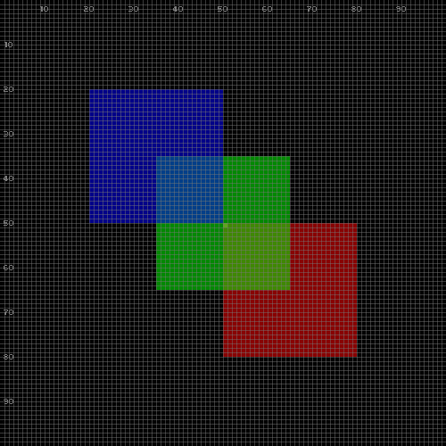
</td></tr>
</table>

We drew all three rectangles at the same pixel position, but with different
anchors.

The following predefined anchors determine the position inside the object that
is affixed to the drawing coordinates:

```
+-----------+
|NW   N   NE|
| W   C   E |
|SW   S   SE|
+-----------+
```

By default, `pico-lua` uses the center anchor `'C'`.

### 5.3. Tiles

The tile mode `'#'` uses discrete sized blocks as references for positions and
dimensions:

<table>
<tr><td><pre>
> pico.init(false)
> pico.init(true)
> pico.set.view {
    dim  = { '#', w=5, h=5 },
    tile = { w=20, h=20 },
  }
> pico.set.window {
    dim = { '#', w=40, h=40 },
  }
> pico.output.draw.rect { '#', x=3, y=3, w=1, h=1 }
> pico.output.draw.rect { '#', x=5, y=1, w=2, h=1, anchor='NE' }
</pre>
</td><td>
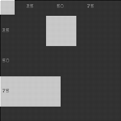
</td></tr>
</table>

In the example, we set each tile to `20x20` and create a world of `5x5` tiles.
Note that the window can also be specified in tiles.

We then draw two rectangles also using the tile mode `'#'`:
- The first is centered at `(3,3)` occupying `1x1` tile.
- The second uses anchor `NE`, to properly occupy the top right of the screen
  with `2x1` tiles.

## 6. Advanced View

The view controls how the logical world maps to the physical window:

- `pico.set.window` controls the **physical** window
- `pico.set.view` controls the **logical** world

Next, we discuss some advanced properties for `pico.set.view`:

| Property | Description             |
|----------|-------------------------|
| `target` | world to window mapping |
| `source` | visible world region    |
| `clip`   | world clipping region   |

### 6.1. Target

The `target` property controls where on the physical window the world is
rendered:

<table>
<tr><td><pre>
> pico.output.clear()
> pico.output.draw.image("img/open.png", {'%', x=0.5, y=0.5, w=0.5, h=0.5})
> pico.set.view {
    target = { '%', x=0.66, y=0.66, w=0.4, h=0.3 },
  }
</pre>
</td><td>

</td></tr>
</table>

The visible effect is to move the world to fit a smaller target window at the
bottom-right of the screen, with a slight distortion, since `w/h` now mismatch.

### 6.2. Source

The `source` property selects which region of the logical world is visible:

<table>
<tr><td><pre>
> pico.init(false)
> pico.init(true)
> pico.output.draw.image("img/open.png", {'%', x=0.5, y=0.5, w=0.5, h=0.5})
> pico.set.view {
    source = { '%', x=0.5, y=0.6, w=0.3, h=0.3 },
    target = { '%', x=0.5, y=0.5, w=0.3, h=0.3 },
  }
</pre>
</td><td>
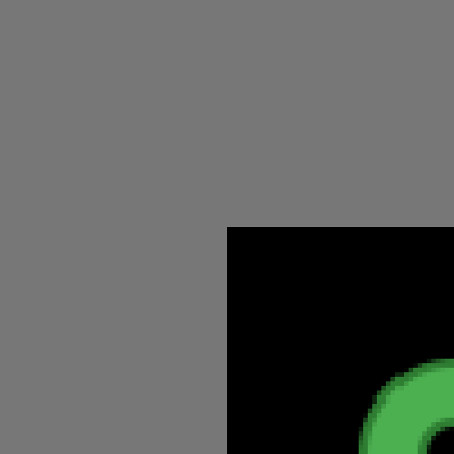
</td></tr>
</table>

We crop a small piece (`30%`) of the center-bottom of the world to target the
center of the window, keeping the same aspect ratio.

### 6.3. Clip

The `clip` property restricts drawing to a sub-region of the world:

<table>
<tr><td><pre>
> pico.init(false)
> pico.init(true)
> pico.set.view {
    clip = { '%', x=0.5, y=0.5, w=0.25, h=0.25 },
  }
> pico.output.draw.image("img/open.png", {'%', x=0.5, y=0.5, w=0.5, h=0.5})
</pre>
</td><td>
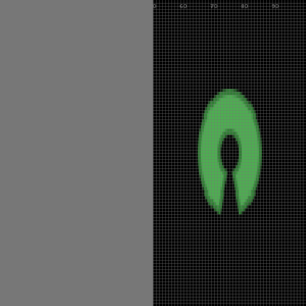
</td></tr>
</table>

We restrict drawing to a small region (`25%`) in the center of the world.
Then, we draw the centered image, which is clipped to fit the specified area.

### 6.4. Zoom & Scroll

When `source` is combined with the default full-window target, the selected
region is stretched to fill the entire window:

<table>
<tr><td><pre>
> pico.init(false)
> pico.init(true)
> pico.output.draw.image("img/open.png", {'%', x=0.5, y=0.5, w=0.5, h=0.5})
> pico.set.view {
    source = { '%', x=0.5, y=0.5, w=0.5, h=0.5 },
  }
</pre>
</td><td>
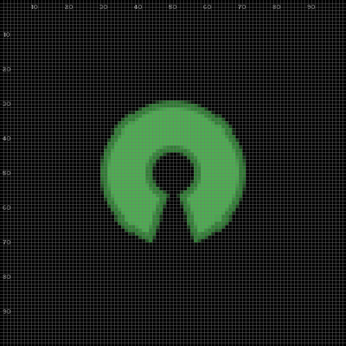
</td></tr>
</table>

Cropping the source to half (`w=0.5`,`h=0.5`) and starting from its center
(`x=0.5`,`y=0.5`) resuluts in a 2x zoom.

Now, applying an offset to current position creates a scroll effect:

<table>
<tr><td><pre>
> pico.set.view {
    source = { '%', x=0.6, y=0.5, w=0.5, h=0.5 },
  }
</pre>
</td><td>
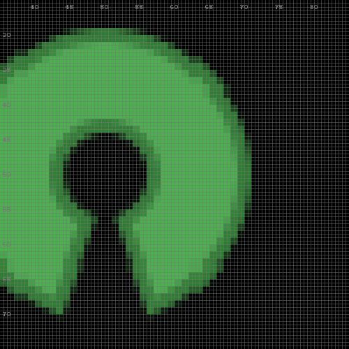
</td></tr>
</table>

A positive `x=0.1` offset (from `0.5` to `0.6`) crops the left side of the
source, which still targets the whole window, resulting in a left scroll.

## 7. Events

I addition to output and drawing operations, `pico-lua` also provides functions
to handle time and user input.

### 7.1. Delay

A call to `pico.input.delay(ms)` pauses execution for the specified time:

<table>
<tr><td><pre>
> pico.init(false)
> pico.init(true)
> pico.output.draw.pixel { '!', x=25, y=50 } -- copy/paste all next lines at once
  pico.input.delay(1000)
  pico.output.draw.pixel { '!', x=50, y=50 }
  pico.input.delay(1000)
  pico.output.draw.pixel { '!', x=75, y=50 }
</pre>
</td><td>
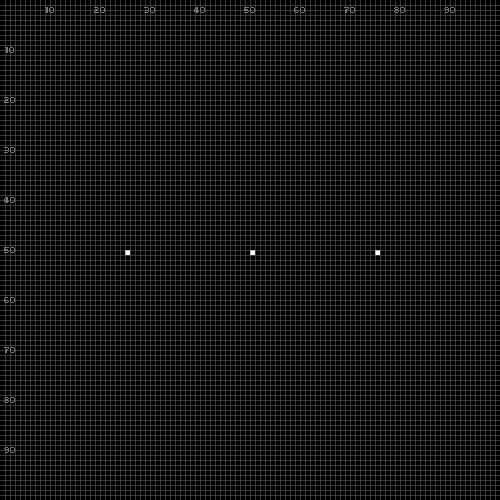
</td></tr>
</table>

After each drawing, we pause execution for `1s`, also blocking (freezing) the
Lua prompt.

Combined with loops, delays can create non-interactive animations.
Here, we draw a circle pixel by pixel:

<table>
<tr><td><pre>
> pico.output.clear()
> for i=1, 400 do
    local rad = i * math.pi / 180
    pico.output.draw.pixel { '!',
      x = 50 + 30*math.cos(rad),
      y = 50 + 30*math.sin(rad),
    }
    pico.input.delay(10)
  end
</pre>
</td><td>
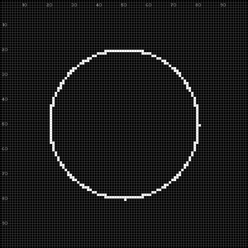
</td></tr>
</table>

On each step, we draw a single pixel and delay for a short period.

### 7.2. Event

To create interactive applications, we use `pico.input.event` to wait for input
events.

Let's create a simple loop to explore the possibilities:

```lua
> while true do
    local e = pico.input.event()
    print("EVENT", e.tag)
    for k,v in pairs(e) do
        print('', k, v)
    end
    if e.tag=='key.dn' and e.key=='Escape' then
        break
    end
  end
```

You may interact with the window by pressing keys, using the mouse, resizing
the window, and so on.
To escape the loop, press the `Escape` key.

Event types (*tags*) include `'key.dn'`, ``'mouse.button.dn'`,
`'mouse.motion'`, and many others.

We can filter events and set timeouts:

```lua
> e1 = pico.input.event('key.dn')        -- wait for key press only
> e2 = pico.input.event('key.dn', 1000)  -- wait up to 1000ms
```

When a timeout expires without an event, `nil` is returned:

```lua
> print(e2) -- nil, after 1000 if no keys pressed
```

### 7.3. Default Key Bindings

By default, `pico-lua` provides key bindings to zoom and scroll the current
view:

- `CTRL` / `+`,`-`: zoom in / out
- `CTRL` / Arrow keys: scroll left / right

Let's draw a centered image and use the key bindings to explore it:

<table>
<tr><td><pre>
> pico.output.draw.image("img/open.png",
    {'%', x=0.5, y=0.5, w=0.5, h=0.5})
> pico.input.loop()
</pre>
</td><td>

</td></tr>
</table>

The call to `pico.input.loop()` allows `pico-lua` to handle events.

Now, try `CTRL` pressing `+` to zoom in and the arrow keys to scroll around.
Finally, close the window (e.g., `ALT+F4`) to return from the loop.

## 8. Layers

Layers are independent views, where you can draw shapes in separate, and them
compose to form complex scenes.

The main logical world is itself a layer, as well as images, texts, buffers,
and videos.
Therefore, all discussed [#view properties](#6-advanced-view) also apply to
layers.

### 8.1. Creating Layers

We use `pico.layer.empty` to create a fresh layer, and `pico.set.layer` to
redirect further drawing operations to it:

```lua
> pico.output.clear()
> pico.layer.empty("flag", {w=300, h=200})
> pico.set.layer("flag")
> pico.set.color.draw { r=0x00, g=0x2B, b=0x7F }
  pico.output.draw.rect { '%', x=0.00, y=0.0, w=0.33, h=1.0, anchor='NW' }
  pico.set.color.draw { r=0xFC, g=0xD1, b=0x16 }
  pico.output.draw.rect { '%', x=0.33, y=0.0, w=0.34, h=1.0, anchor='NW' }
  pico.set.color.draw { r=0xCE, g=0x11, b=0x26 }
  pico.output.draw.rect { '%', x=0.67, y=0.0, w=0.33, h=1.0, anchor='NW' }
```

We identify the layer as `"flag"` and then set it as the current drawing layer.
Then, we paint the layer with the colors.

At this point, nothing appears on the screen yet, since we did not update the
world view.

### 8.2. Compositing

To compose layers, we use `pico.output.draw.layer` on a "parent" layer:

<table>
<tr><td><pre>
> pico.set.layer()      -- back to main world
> pico.output.clear()
> pico.output.draw.layer("flag", {'%', x=0.33, y=0.33, w=0.2})
> pico.output.draw.layer("flag", {'%', x=0.66, y=0.66, w=0.5})
</pre>
</td><td>
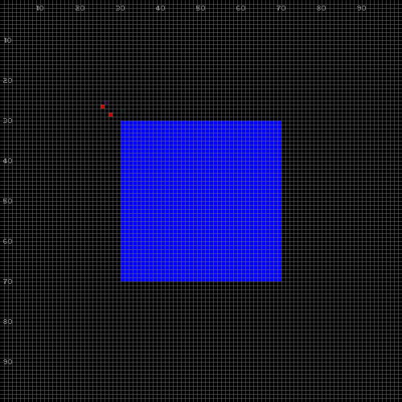
</td></tr>
</table>

We first use `pico.set.layer()`, with no arguments, to target the world layer.
Then, we clear it and compose the flag twice, with different arguments.

### 8.3. Flip & Rotate

To flip and rotate a layers, we can use `pico.set.view` while targeting it.

First, let's rotate the flag and draw it at the top-right:

<table>
<tr><td><pre>
> pico.set.layer("flag")
> pico.set.view { rotation={angle=30, anchor='C'} }
> pico.set.layer()
> pico.output.draw.layer("flag", {'%', x=0.75, y=0.25, w=0.3})
</pre>
</td><td>
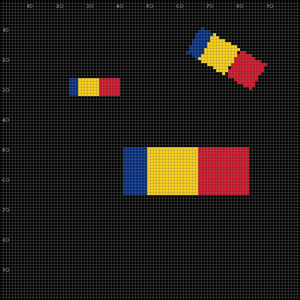
</td></tr>
</table>

The `rotation` table takes an `angle` in degrees and an `anchor` for the pivot
point.

Now, let's reset the rotation, flip horizontally, and draw the flag at the
bottom-left:

<table>
<tr><td><pre>
> pico.set.layer("flag")
> pico.set.view {
    rotation = {angle=0},
    flip = 'horizontal',
  }
> pico.set.layer()
> pico.output.draw.layer("flag", {'%', x=0.25, y=0.80, w=0.2})
</pre>
</td><td>
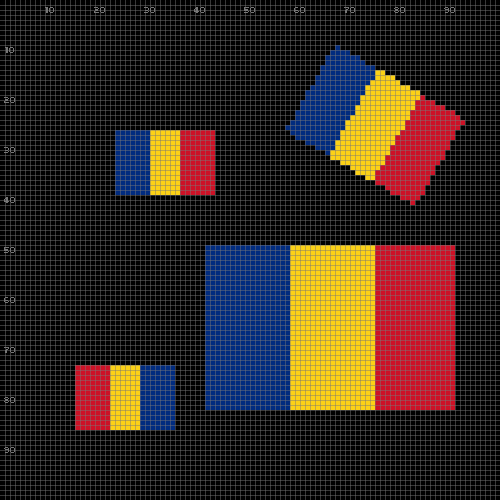
</td></tr>
</table>

The `flip` field receives `"horizontal"` to reverse the stripe order, which can
be stated visually.

### 8.4. Sub-Layers

A sub-layer points to a region within a parent layer, sharing the actual pixel
contents.

Sub-layers are useful to isolate individual frames from a sprite sheet in
games, which we will discuss in [#Animations](#91-animations).

We call `pico.layer.sub` to crop a region of a parent layer:

<table>
<tr><td><pre>
> pico.layer.sub("blue",   "flag", {'%', x=0.25, y=0.5, w=0.1, h=0.15, anc='C'})
> pico.layer.sub("yellow", "flag", {'%', x=0.50, y=0.5, w=0.1, h=0.15, anc='C'})
> pico.layer.sub("red",    "flag", {'%', x=0.75, y=0.5, w=0.1, h=0.15, anc='C'})
> pico.output.clear()
> pico.output.draw.layer("blue",   {'%', x=0.30, y=0.30, w=0.25})
> pico.output.draw.layer("yellow", {'%', x=0.70, y=0.45, w=0.25})
> pico.output.draw.layer("red",    {'%', x=0.45, y=0.75, w=0.25})
</pre>
</td><td>
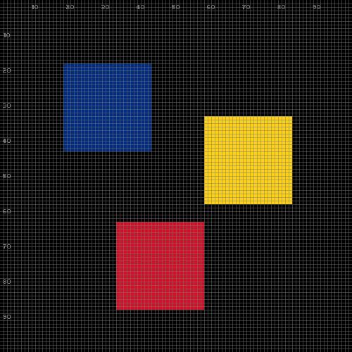
</td></tr>
</table>

The first parameter identifies the sub-layer for further operations.
Drawing a sub-layer works exactly like drawing a regular layer with
`pico.output.draw.layer`.

In the example, each sub-layer crops a square from each stripe of the flag
(blue, yellow, red), and then draws each on the screen.

## 9. Expert Mode

By default, each drawing operation in `pico-lua` becomes immediatly visible on
the screen.

However, to keep visual objects in sync, most games and non-trivial
applications require them to draw simultaneously on every frame.

With `pico.set.expert`, drawing operations are buffered until an explicit
call to `pico.output.present`, which updates the screen all at once:

<table>
<tr><td><pre>
> pico.output.clear()
> pico.set.expert(true)
> pico.output.draw.rect { '!', x=33, y=33, w=40, h=40 }
> pico.input.delay(1000)
> pico.output.draw.rect { '!', x=66, y=66, w=40, h=40 }
> pico.input.delay(1000)
</pre>
</td><td>

</td></tr>
</table>

At this point, nothing appears on the screen yet, since we have not yet called
`pico.output.present`:

<table>
<tr><td><pre>
> pico.output.present()
</pre>
</td><td>
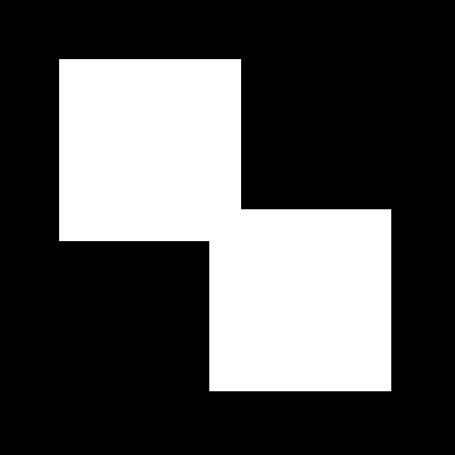
</td></tr>
</table>

Now, both the rectangles appear at the same time.

### 9.1. Animations

The expert mode is essential to synchronize multiple animations in games.
With `pico.output.present`, all sprites update together in the same frame.

As an example, let's animate two characters walking along overlapping
rectangular paths.

First, we load a sprite sheet with `pico.layer.images`, which splits an image
into a grid of [#sub-layers](#84-sub-layers), as previously discussed:

<table>
<tr><td><pre>
frames = pico.layer.images("walk",
    "img/walk.png", {'#', w=4, h=4})
</pre>
</td><td align="center">
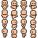
<br>
<small>
    Credits:
        <a href="https://opengameart.org/content/simple-character-base-16x16">
            OpenGameArt.org
        </a>
</small>
</td></tr>
</table>

This splits the 4x4 sprite sheet into sub-layers `"walk-1"` to
`"walk-16"`: walk down (1-4), up (5-8), right (9-12), left (13-16).

Now we define a helper that returns the sprite frame and position for a
given step along a path:

```lua
pico.set.expert(true)
dirs = {
    right = { 9, 10, 11, 12},
    down  = { 1,  2,  3,  4},
    left  = {13, 14, 15, 16},
    up    = { 5,  6,  7,  8},
}
function walk(path, steps, step, fstep)
    local leg = path[(step // steps) % #path + 1]
    local t = (step % steps) / steps
    local x = leg.x + (leg.tx - leg.x) * t
    local y = leg.y + (leg.ty - leg.y) * t
    local f = dirs[leg.dir]
    return frames[f[fstep % 4 + 1]], x, y
end
```

Two rectangular paths define each character's route — `cw` traces the
first rectangle clockwise (faster), `ccw` traces the second
counter-clockwise (slower). Each leg has a start `(x,y)`, direction
`dir`, and target `(tx,ty)`:

```lua
cw = {
    {x=0.08, y=0.08, dir='right', tx=0.58, ty=0.08},
    {x=0.58, y=0.08, dir='down',  tx=0.58, ty=0.58},
    {x=0.58, y=0.58, dir='left',  tx=0.08, ty=0.58},
    {x=0.08, y=0.58, dir='up',    tx=0.08, ty=0.08},
}
ccw = {
    {x=0.41, y=0.41, dir='down',  tx=0.41, ty=0.91},
    {x=0.41, y=0.91, dir='right', tx=0.91, ty=0.91},
    {x=0.91, y=0.91, dir='up',    tx=0.91, ty=0.41},
    {x=0.91, y=0.41, dir='left',  tx=0.41, ty=0.41},
}
```

The animation loop draws both sprites and two stroke rectangles each
frame, then `present` flips them on-screen together.
The clockwise character runs at twice the pace (`step*2`), yet both
update in perfect sync:

<table>
<tr><td><pre>
pico.set.style 'stroke'
for step=0, math.huge do
    local f1, x1, y1 = walk(cw,  20, step*2, step)
    local f2, x2, y2 = walk(ccw, 20, step,   step)
    pico.output.clear()
    pico.output.draw.rect { '%', x=0.33, y=0.33, w=0.50, h=0.50 }
    pico.output.draw.rect { '%', x=0.66, y=0.66, w=0.50, h=0.50 }
    pico.output.draw.layer(f1, {'%', x=x1, y=y1, w=0.15})
    pico.output.draw.layer(f2, {'%', x=x2, y=y2, w=0.15})
    pico.output.present()
    pico.input.delay(50)
end
</pre>
</td><td>
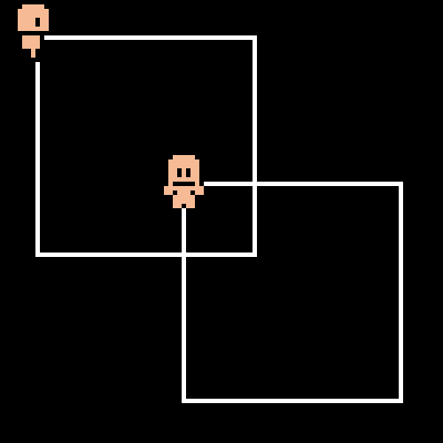
</td></tr>
</table>

## 10. Auxiliary Functions

`pico-lua` provides utility functions for coordinate conversion and collision
detection.

### 10.1. Coordinate Conversions

The `pico.cv` functions convert relative coordinates to absolute:

```lua
> pico.init(true)
> local pos = pico.cv.pos { '%', x=0.5, y=0.5 }
> print(pos.x, pos.y)
50   50
```

```lua
> local rect = pico.cv.rect { '%', x=0.5, y=0.5, w=0.3, h=0.3, anchor='C' }
> print(rect.x, rect.y, rect.w, rect.h)
35   35   30   30
```

An optional `base` rectangle can serve as the reference frame:

```lua
> local base = { '!', x=0, y=0, w=50, h=50 }
> local pos = pico.cv.pos({'%', x=0.5, y=0.5}, base)
> print(pos.x, pos.y)
25   25
```

### 10.2. Collision Detection

The `pico.vs` functions test for collisions:

```lua
> local r = { '!', x=50, y=50, w=20, h=20 }
> local p = { '!', x=55, y=55 }
> print(pico.vs.pos_rect(p, r))
true
```

```lua
> local r1 = { '!', x=50, y=50, w=20, h=20 }
> local r2 = { '!', x=60, y=60, w=20, h=20 }
> print(pico.vs.rect_rect(r1, r2))
true
```

## 11. Extras

### 11.1. Fullscreen Mode

### 11.2. Playing Sounds

To play a sound file:

```lua
> pico.output.sound('path/to/sound.wav')
```

### 11.3. Screenshots

To save a screenshot of the current window:

```lua
> pico.output.screenshot('my-screenshot.png')
```

An optional rectangle crops the screenshot:

```lua
> pico.output.screenshot('crop.png', {'!', x=10, y=10, w=50, h=50})
```
