# Guide

1.  [Introduction](#1-introduction)
2.  [Initialization](#2-initialization)
3.  [Basic Drawing](#3-basic-drawing)
4.  [Positioning: Modes & Anchors](#4-positioning-modes--anchors)
5.  [Advanced Views](#5-advanced-views)
6.  [Events](#6-events)
7.  [Layers](#7-layers)
8.  [Expert Mode](#8-expert-mode)

## 1. Introduction

`pico-lua` is a graphics library for 2D games and applications.
It is designed around 4 groups of APIs:

- `pico.output.*`: draw shapes and layers; play sound and video.
- `pico.input.*`: handle events, such as time passing and key presses.
- `pico.get.*` and `pico.set.*`: manage internal library state,
    such as current drawing color, and window dimensions.
- `pico.layer.*`: structure visuals in hierarchical scenes.

This guide is an interactive walk-through of `pico-lua`.
It is not meant to be exhaustive.
Consult the [API](api.md) for completeness.

From the command line, simply execute `pico-lua` with no parameters:

```bash
$ pico-lua
Lua 5.4.4  Copyright (C) 1994-2022 Lua.org, PUC-Rio
>
```

The Lua prompt `>` indicates that `pico-lua` is ready to receive commands.

## 2. Initialization

### 2.1. Open

To initialize `pico-lua`, we pass `true` to `pico.init`:

<table>
<tr><td><pre>
> pico.init(true)
</pre>
</td><td>
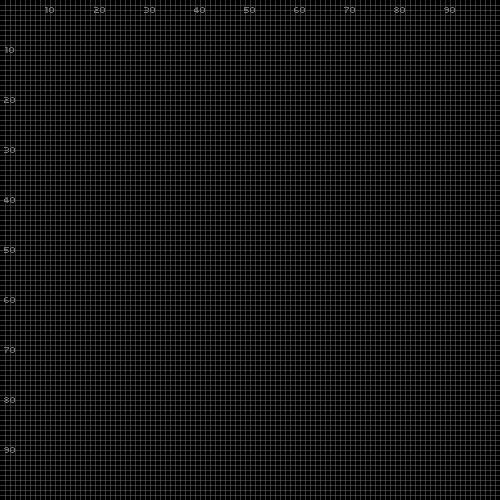
</td></tr>
</table>

We immediately see a `500x500` window divided in small `5x5` rectangles
representing `100x100` **logical pixels**.

In the context of `pico-lua`, we use the term **world** to designate the
logical view, which applications use as the main reference.

By default, note that `pico-lua` conventionally exhibits the grid and
coordinate labels to aid development with visual inspection.
You may click the image to zoom in.

### 2.2. Configure

To configure the window and the world view, we use `pico.set.window` and
`pico.set.scene`:

<table>
<tr><td><pre>
> pico.set.window {
    title = "Hello!",
    dim   = { '!', w=200, h=200 },
  }
> pico.set.scene {
    dim = { '!', w=200, h=200 },
  }
</pre>
</td><td>
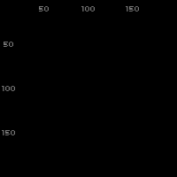
</td></tr>
</table>

After the two commands, the window title changes and the grid disappears, since
the pixel size is now `1x1`.

The character `'!'` indicates a dimension in "raw mode", which we discuss in
[#Positioning Modes](#4-positioning-modes--anchors).

You could also use the simpler `pico.set.dim` to set the window and view
dimensions at the same time:

<table>
<tr><td><pre>
> pico.set.dim { '!', w=200, h=200 }
</pre>
</td><td>

</td></tr>
</table>

*(The image is the same as before.)*

### 2.3. Close

In the end of the session, we should pass `false` to `pico.init` to properly
finalize `pico-lua`:

<table>
<tr><td><pre>
> pico.init(false)
</pre>
</td><td>
*(no image)*
</td></tr>
</table>

Then, we can restart `pico-lua` by calling `pico.init(true)` again:

<table>
<tr><td><pre>
> pico.init(true)
</pre>
</td><td>

</td></tr>
</table>

We can see that the title, grid, and sizes are now reset to default.

## 3. Basic Drawing

To ease prototyping, drawing operations in `pico-lua` take immediate effect.

### 3.1. Shapes

To draw a single pixel, we call `pico.output.draw.pixel`:

<table>
<tr><td><pre>
> pico.output.draw.pixel { '!', x=50, y=50 }
</pre>
</td><td>
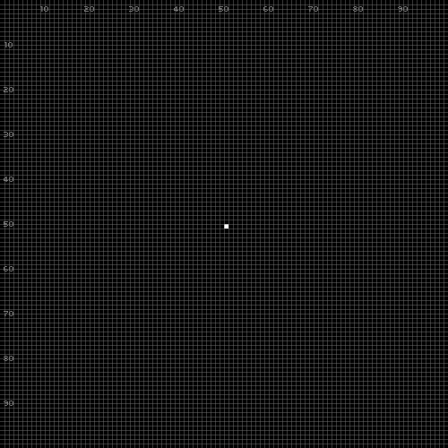
</td></tr>
</table>

The pixel occupies a physical `5x5` square representing a single world pixel,
as expected.

To draw a rectangle, we call `pico.output.draw.rect`:

<table>
<tr><td><pre>
> pico.output.draw.rect { '!', x=20, y=20, w=30, h=30 }
</pre>
</td><td>
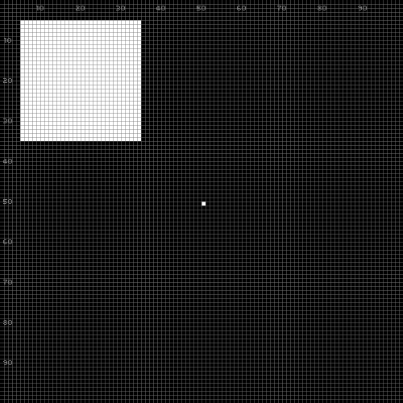
</td></tr>
</table>

The table specifies a rectangle at position `(20,20)` with size `30x30`.

Unlike most graphics libraries, `pico-lua` **centers** objects by default,
which we discuss in [#Anchors](#4-positioning-modes--anchors).
With the aid of the tick marks, we can see that the rectangle is actually
centered at the given position.

Note that `pico-lua` retains both shapes on the screen.

Other drawing operations include `pico.output.draw.line`,
`pico.output.draw.poly`, and `pico.output.draw.oval`.

### 3.2. Colors

To clear the screen, we call `pico.output.clear`:

<table>
<tr><td><pre>
> pico.output.clear()
</pre>
</td><td>

</td></tr>
</table>

Now the pixel and rectangle are gone.

By default, `pico-lua` uses black to clear the screen and white to draw shapes.

To pick different colors, we use `pico.set.effect` and `pico.set.pencil` passing
the `color` attribute:

<table>
<tr><td><pre>
> pico.set.effect { color='yellow' }  -- background
> pico.set.pencil { color='red'    }  -- shapes
> pico.output.clear()
> pico.output.draw.rect { '!', x=50, y=50, w=50, h=50 }
</pre>
</td><td>
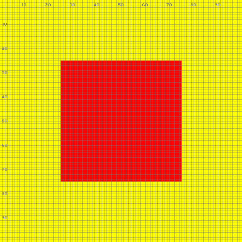
</td></tr>
</table>

In the example, we set the background color as yellow, and the drawing color
for shapes as red.
A `set` has no immediate effect on the screen, and only affects further
operations.
Next, we actually clear the screen and draw a centered rectangle.

Colors can also be specified as numbers or tables:

<table>
<tr><td><pre>
> pico.set.pencil {       -- 0xRRGGBB[AA]
    color = 0xCCCCCC
  }
  pico.output.draw.pixel { '!', x=26, y=26 }

> pico.set.pencil {       -- percent mode '%' (0.0-1.0)
    color={ '%', r=0, g=0.5, b=0, a=0.5 }
  }
  pico.output.draw.pixel { '!', x=73, y=73 }
</pre>
</td><td>
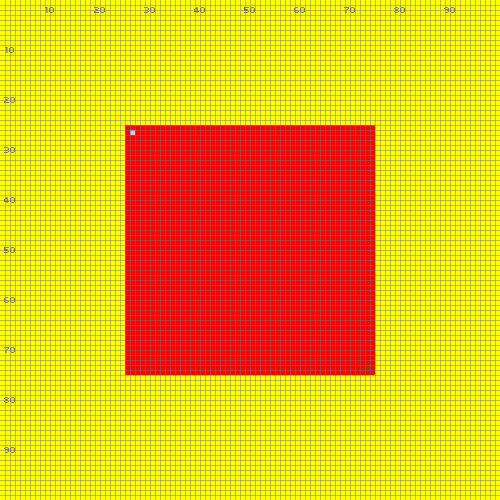
</td></tr>
</table>

Let's restart `pico-lua` for the next examples:

<table>
<tr><td><pre>
> pico.init(false)
> pico.init(true)
</pre>
</td><td>

</td></tr>
</table>

### 3.3. Text, Image and Pixmap

To draw text, we call `pico.output.draw.text`:

<table>
<tr><td><pre>
> pico.output.draw.text("Hello", {'!', x=50, y=33, h=30})
> pico.set.pencil { font='DejaVuSans.ttf' }
> pico.output.draw.text("Hello", {'!', x=50, y=66, h=30})
</pre>
</td><td>
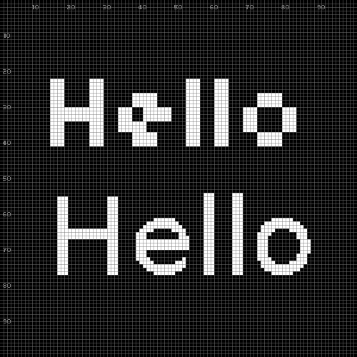
</td></tr>
</table>

*(You may need to save the [font](../../res/DejaVuSans.ttf) on your machine.)*

We first draw `Hello` at the top using the default built-in font.
Then, we switch the font and draw `Hello` again at the bottom.

Note that `pico-lua` preserves the correct text aspect ratio when width `w` is
omitted.

To draw an [image](../../res/open.png), we call `pico.output.draw.image`:

<table>
<tr><td><pre>
> pico.output.clear()
> pico.output.draw.image("open.png", {'!', x=50, y=50})
</pre>
</td><td>
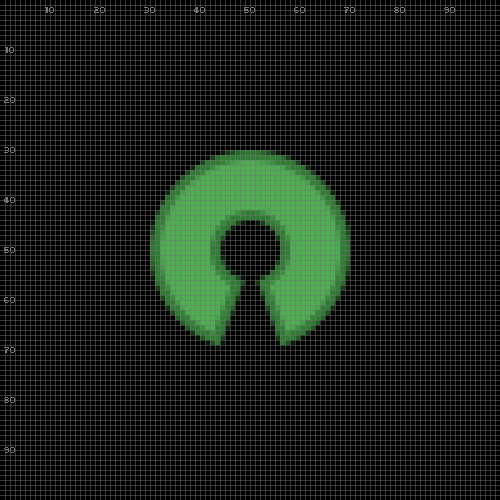
</td></tr>
</table>

*(You may need to save the [image](../../res/open.png) on your machine.)*

For images, we can omit both width `w` and height `h` to preserve original
dimensions and aspect ratio.

`pico-lua` also supports pixmaps, which are arrays of colored pixels:

<table>
<tr><td><pre>
> _ = 'black'
  o = 'blue'
  x = 'silver'
  PI = {
      {_,_,_,o,o,o,o,_,_,_},
      {_,o,o,o,o,o,o,o,o,_},
      {_,o,x,x,x,x,x,x,o,_},
      {o,o,o,x,o,o,x,o,o,o},
      {o,o,o,x,o,o,x,o,o,o},
      {o,o,o,x,o,o,x,o,o,o},
      {o,o,o,x,o,o,x,o,o,o},
      {_,o,o,x,o,o,x,o,o,_},
      {_,o,o,o,o,o,o,o,o,_},
      {_,_,_,o,o,o,o,_,_,_},
  }
> pico.output.draw.pixmap("pi", PI, {'!', x=50, y=50, w=80})
</pre>
</td><td>
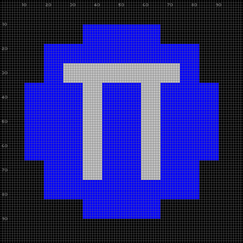
</td></tr>
</table>

The table `PI` determines the color of each pixel to draw.
We use single-char color variables to ease visualizing: the Greek letter `pi`,
on top of blue circle, on top of a black background.

Note that pixmaps require a string identifier as first parameter for proper
caching.

Internally, `pico-lua` caches texts, images and pixmaps such that they are
reused on subsequent redraws.
We detail caching in [#Layers](#7-layers).

## 4. Positioning: Modes & Anchors

The positioning **mode** determines the unit used in world coordinates:

- `'!'` - Raw: world pixel coordinates
            (from `0` to world `w/h`)
- `'%'` - Percentage: coordinates relative to world `w/h`
            (from `0.0` to `1.0`)
- `'#'` - Tile: grid coordinates based on tile and world `w/h`
            (from `0` to `w/h`)

The percentage mode `'%'` is preferable, since it is independent of world
dimensions and adapts naturally to resizes.
For instance, `{ '%', x=0.5, y=0.5 }` always points to the center of the
world, regardless of its size.

The mode is set at index `1` in tables representing positions, dimensions, and
rectangles:

- `{ '%', x=0.5, y=0.5 }`:          a centered relative position
- `{ '!', w=20, h=30 }`:            a raw dimension
- `{ '#', x=4, y=4, w=2, h=1 }`:    a rectangle covering 2 tiles horizontally

The positioning **anchor** determines the reference point **within** the shape:

```
+-----------+
|NW   N   NE|
| W   C   E |
|SW   S   SE|
+-----------+
```

When drawing, the anchor position is pinned to the given coordinate.
As shown in the previous examples, by default, `pico-lua` uses the center
anchor `'C'`.

The anchor is set at field `anchor` in tables representing positions:

- `{ '%', x=0.5, y=0.5, w=0.5, h=0.5, anchor='SW' }`:
    the rectangle's *southwest* corner pinned at center of the screen

Let's draw a pixel and three rectangles, all at the same position, but using
different anchors:

<table>
<tr><td><pre>
> pico.init(false) ; pico.init(true)
> pico.set.pencil { color='white' }
> pico.output.draw.pixel { '%', x=0.5, y=0.5 }
> pico.set.pencil { color=pico.color.alpha('red', 0x80) }
> pico.output.draw.rect { '%', x=0.5, y=0.5, w=0.3, h=0.3, anchor='NW' }
> pico.set.pencil { color=pico.color.alpha('green', 0x80) }
> pico.output.draw.rect { '%', x=0.5, y=0.5, w=0.3, h=0.3, anchor='C' }
> pico.set.pencil { color=pico.color.alpha('blue', 0x80) }
> pico.output.draw.rect { '%', x=0.5, y=0.5, w=0.3, h=0.3, anchor='SE' }
</pre>
</td><td>
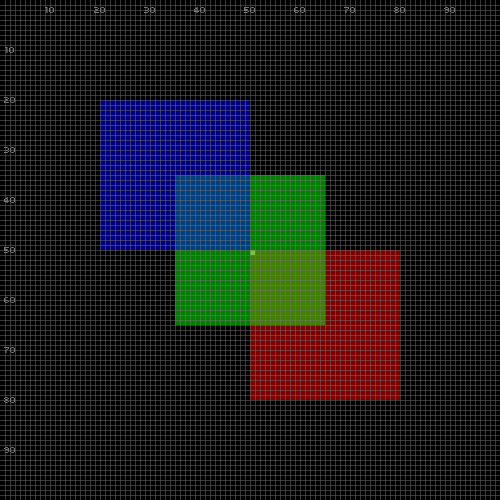
</td></tr>
</table>

The pixel represents the reference position `%(0.5,0.5)` used by the three
rectangles.
The `0x80` alpha makes the overlapping regions reveal how the pinned anchors
offset each rectangle from the same coordinate:

- the **red** rectangle places its `NW` corner at `(0.5,0.5)`
- the **green** one places its center `C` there
- the **blue** one places its `SE` corner there

### 4.1. Tiles

The tile mode `'#'` uses discrete sized blocks as references for positions and
dimensions:

<table>
<tr><td><pre>
> pico.init(false) ; pico.init(true)
> pico.set.scene {
    tile = { w=20, h=20 },     -- tile size (20x20 physical)
    dim  = { '#', w=5, h=5 },  -- world size in tiles (5x5 logical)
  }
> pico.set.window {
    dim = { '#', w=40, h=40 }, -- window size (40x40 x 20x20 tiles)
  }
> pico.output.draw.rect { '#', x=3, y=3, w=1, h=1 }
> pico.output.draw.rect { '#', x=5, y=1, w=2, h=1, anchor='NE' }
</pre>
</td><td>
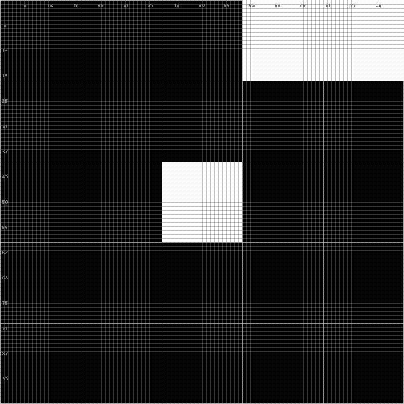
</td></tr>
</table>

In the example, we set each tile to `20x20` and create a world of `5x5` tiles.
Note that the window can also be specified in tiles.

We then draw two rectangles using the tile mode `'#'`:
- The first is centered at `(3,3)` occupying `1x1` tile (`20x20` pixels).
- The second uses anchor `NE`, to properly occupy the top right of the screen
  with `2x1` tiles (`40x20` pixels).

## 5. Advanced Views

The view controls how the logical world maps to the physical window:

- `pico.set.window` controls the **physical** window
- `pico.set.scene` controls the **logical** world

Next, we discuss some advanced properties for `pico.set.scene`:

| Property | Description             |
|----------|-------------------------|
| `target` | world to window mapping |
| `source` | visible world region    |
| `clip`   | world clipping region   |

The `target` property controls where the world is rendered within the physical
window:

<table>
<tr><td><pre>
> pico.init(false) ; pico.init(true)
> pico.output.draw.image("open.png", {'%', x=0.5, y=0.5, w=0.5, h=0.5})
> pico.set.scene {
    target = { '%', x=0.8, y=0.8, w=0.3, h=0.2 },
  }
</pre>
</td><td>
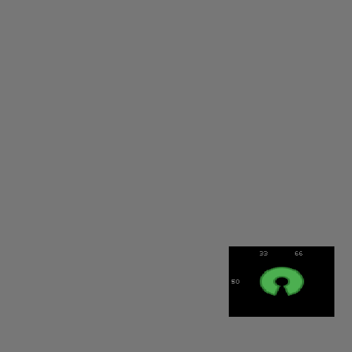
</td></tr>
</table>

Note how the world moves to fit a smaller target window at the bottom-right of
the screen, with a slight distortion, since the new `w/h` changes the aspect
ratio.

The `source` property selects which region of the world is visible:

<table>
<tr><td><pre>
> pico.set.scene {
    source = { '%', x=0.5, y=0.5, w=0.4, h=0.4 },
  }
</pre>
</td><td>
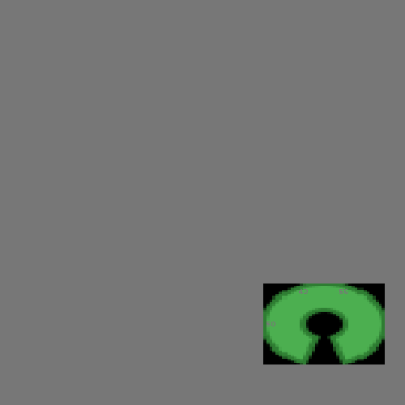
</td></tr>
</table>

We now crop a small piece (`40%`) of the world from its center.
The visual effect is to zoom in the image, since we stretch out the world piece
into the same target.

The `clip` property restricts the effect of drawing operations into a
sub-region of the world:

<table>
<tr><td><pre>
> pico.init(false) ; pico.init(true)
> pico.set.scene {
    clip = { '%', x=0.5, y=0.5, w=0.25, h=0.25 },
  }
> pico.output.draw.image("open.png", {'%', x=0.5, y=0.5, w=0.5, h=0.5})
</pre>
</td><td>
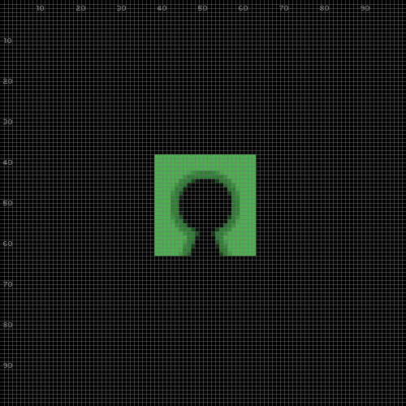
</td></tr>
</table>

We restrict drawing to a small region (`25%`) in the center of the world.
Then, we draw the image centered, which is clipped to fit the specified area.

### 5.1. Zoom & Scroll

We can manipulate the `source` view property to implement not only zooming, as
illustrated above, but also scrolling effects.

Let's restart with a centered image over a black window background matching the
world black background when we zoom out:

<table>
<tr><td><pre>
> pico.init(false) ; pico.init(true)
> pico.set.window { color='black' } -- (typically grey to distinguish from world)
> pico.output.draw.image("open.png", {'%', x=0.5, y=0.5, w=0.5, h=0.5})
</pre>
</td><td>
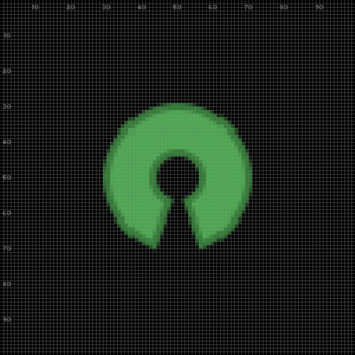
</td></tr>
</table>

Next, we crop the view in half (`w=h=0.5`) to get a `2x` zoom in:

<table>
<tr><td><pre>
> pico.set.scene {
    source = { '%', x=0.5, y=0.5, w=0.5, h=0.5 },
  }
</pre>
</td><td>
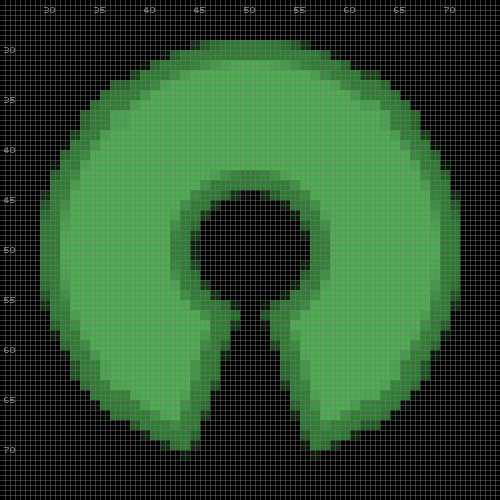
</td></tr>
</table>

Likewise, when we double the source (`w=h=2`), we get a `1/2` zoom out:

<table>
<tr><td><pre>
> pico.set.scene {
    source = { '%', x=0.5, y=0.5, w=2, h=2 },
  }
</pre>
</td><td>
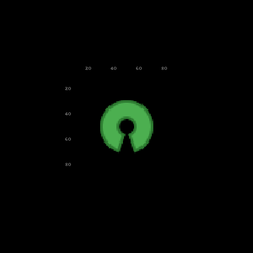
</td></tr>
</table>

We can apply the same reasoning to create a scroll effect when we manipulate
the source `x` and `y` fields:

<table>
<tr><td><pre>
> pico.set.scene {
    source = { '%', x=0.8, y=0.2, w=2, h=2 },
  }
</pre>
</td><td>
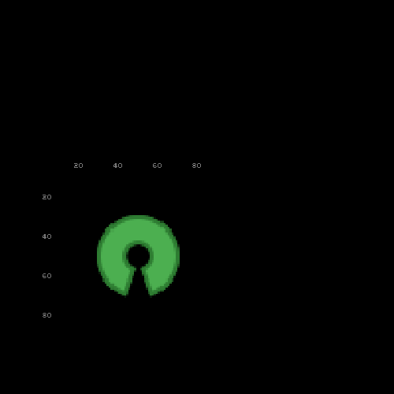
</td></tr>
</table>

A positive `x=0.3` offset (from `0.5` to `0.8`) crops the left side of the
source, which still targets the whole window, resulting in a scroll left.

A negative `y=-0.3` offset (from `0.5` to `0.2`) crops the bottom of the
source, resulting in a scroll down.

## 6. Events

In addition to output and drawing operations, `pico-lua` also provides
functions to handle time and user input.

### 6.1. Delay

A call to `pico.input.delay(ms)` pauses execution for the specified time:

<table>
<tr><td><pre>
> pico.init(false) ; pico.init(true)
> pico.output.draw.pixel { '%', x=0.25, y=0.5 } -- copy/paste next lines all at once
  pico.input.delay(1000)
  pico.output.draw.pixel { '%', x=0.50, y=0.5 }
  pico.input.delay(1000)
  pico.output.draw.pixel { '%', x=0.75, y=0.5 }
</pre>
</td><td>
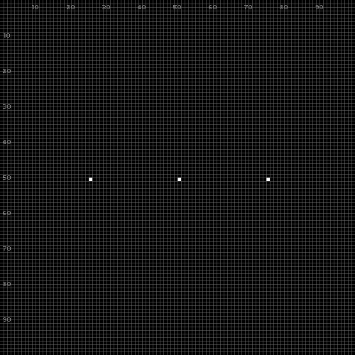
</td></tr>
</table>

After each drawing, we pause execution for `1s`, also blocking (freezing) the
Lua prompt.

Combined with loops, delays can create non-interactive animations.

Here, we draw a circle pixel by pixel:

<table>
<tr><td><pre>
> pico.output.clear()
> for i=1, 400 do
    local rad = i * math.pi / 180
    pico.output.draw.pixel { '%',
      x = 0.5 + 0.3*math.cos(rad),
      y = 0.5 + 0.3*math.sin(rad),
    }
    pico.input.delay(10)
  end
</pre>
</td><td>
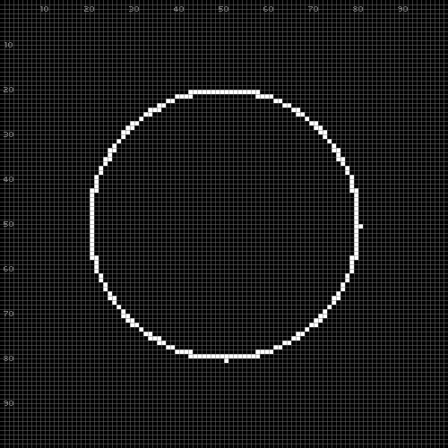
</td></tr>
</table>

On each step, we draw a single pixel and delay execution for a short period.

### 6.2. Event

To create interactive applications, we use `pico.input.event` to wait for input
events.

Let's create a simple loop to explore the possibilities:

```lua
> while true do
    local e,ms = pico.input.event()
    print("EVENT", ms, e.tag)
    for k,v in pairs(e) do
        print('', k, v)
    end
    if e.tag=='key.dn' and e.key=='Escape' then
        break
    end
  end
```

The call to `pico.input.event` returns two values:

- `e` is a table with a `tag` field that identifies the event type
- `ms` is the time elapsed between two event occurrences

You may interact with the window by pressing keys, using the mouse, resizing
the window, and so on.
To escape the loop, press the `Escape` key.

Event types (*tags*) include `'key.dn'`, `'mouse.button.dn'`,
`'mouse.motion'`, and many others.

We can filter events and set timeouts:

```lua
> e1 = pico.input.event('key.dn')        -- wait for key press only
> e2 = pico.input.event('key.dn', 5000)  -- wait key up to 5000ms
```

When a timeout expires without an event, `nil` is returned:

```lua
> print(e2) -- nil, after 5000 if no keys pressed
```

### 6.3. Default Key Bindings

By default, `pico-lua` provides key bindings to zoom and scroll the current
view:

- `CTRL` / `+`,`-`: zoom in / out
- `CTRL` / Arrow keys: scroll left / right

Let's draw a centered image and use the key bindings to explore it:

<table>
<tr><td><pre>
> pico.output.clear()
> pico.output.draw.image("open.png", {'%', x=0.5, y=0.5, w=0.5, h=0.5})
> pico.input.loop()
</pre>
</td><td>

</td></tr>
</table>

The call to `pico.input.loop()` passes full control to `pico-lua` to handle
events internally.

Now, try `CTRL` pressing `+` to zoom in and the arrow keys to scroll around.
Finally, close the window (e.g., `ALT+F4`) to escape from the loop.

## 7. Layers

Layers are independent views, in which you can draw shapes separately, and
then compose them to form complex scenes.

The main logical world is itself a layer, as well as images, texts, buffers,
and videos.
Therefore, all discussed [#view properties](#5-advanced-views) also apply to
layers.

### 7.1. Creating Layers

We use `pico.layer.empty` to create a fresh layer and then pass its identifier
to further API calls:

```lua
> pico.output.clear()
> pico.layer.empty(nil, "flag", {w=300, h=200})
> pico.set.pencil { "flag", color={ r=0x00, g=0x2B, b=0x7F } }
  pico.output.draw.rect("flag", { '%', x=0.00, y=0.0, w=0.33, h=1.0, anchor='NW' })
  pico.set.pencil { "flag", color={ r=0xFC, g=0xD1, b=0x16 } }
  pico.output.draw.rect("flag", { '%', x=0.33, y=0.0, w=0.34, h=1.0, anchor='NW' })
  pico.set.pencil { "flag", color={ r=0xCE, g=0x11, b=0x26 } }
  pico.output.draw.rect("flag", { '%', x=0.67, y=0.0, w=0.33, h=1.0, anchor='NW' })
```

We identify the new layer as `flag` and pass it to state and drawing calls.

At this point, nothing appears on the screen yet, since we did not update the
main world view.

Note that the first argument to `pico.layer.empty` (`nil` in the example)
represents the optional implicit parent layer to be discussed in
[#Hierarchy](#74-hierarchy).

### 7.2. Compositing

To composite layers on the screen, we use `pico.output.draw.layer`:

<table>
<tr><td><pre>
> pico.output.draw.layer("flag", {'%', x=0.33, y=0.33, w=0.2})
> pico.output.draw.layer("flag", {'%', x=0.66, y=0.66, w=0.5})
</pre>
</td><td>
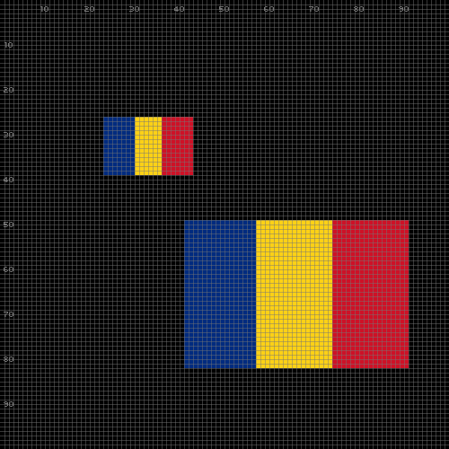
</td></tr>
</table>

We compose the flag twice, with different arguments.
By default, a composite targets the world view.

We can also use `pico.set.effect` to flip and rotate layers:

<table>
<tr><td><pre>
> pico.set.effect { "flag",
    flip   = 'horizontal',
    rotate = {angle=30, anchor='C'},
  }
> pico.output.draw.layer("flag", {'%', x=0.75, y=0.25, w=0.3})
</pre>
</td><td>
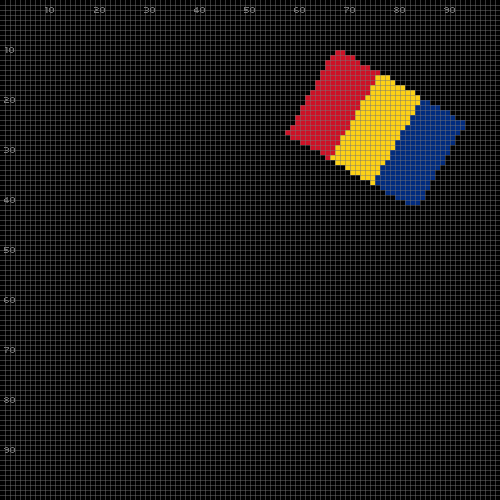
</td></tr>
</table>

In the example, the `flip` field receives `'horizontal'` to reverse the stripe
order.
The `rotate` table takes an `angle` in degrees and an `anchor` for the pivot
point.

We can also set the transparency of layers by lowering their `alpha` field:

<table>
<tr><td><pre>
> pico.set.effect { "flag",
    rotate = {angle=0},
    flip   = 'none',
    alpha  = 0x80,
  }
> pico.output.draw.layer("flag", {'%', x=0.5, y=0.5, w=0.6})
</pre>
</td><td>
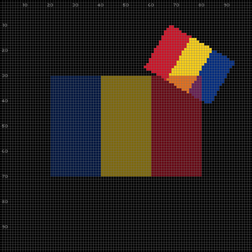
</td></tr>
</table>

Following the general conventions for alpha,
    `0x00` is fully transparent, while
    `0xFF` is fully opaque.

### 7.3. Sub-Layers

A sub-layer points to a region within a source layer, with both sharing the
actual pixel contents.

Sub-layers are useful to isolate individual frames from sprite sheets in games,
which we discuss in [#Animations](#93-animations).

We call `pico.layer.sub` to crop a region of a source layer.
In the next example, we want to isolate each stripe of the flag as a sub layer:

<table>
<tr><td><pre>
> pico.layer.sub(nil, "blue",   "flag", {'%', x=0.25, y=0.5, w=0.1, h=0.15})
> pico.layer.sub(nil, "yellow", "flag", {'%', x=0.50, y=0.5, w=0.1, h=0.15})
> pico.layer.sub(nil, "red",    "flag", {'%', x=0.75, y=0.5, w=0.1, h=0.15})
> pico.output.clear()
> pico.output.draw.layer("blue",   {'%', x=0.30, y=0.30, w=0.25})
> pico.output.draw.layer("yellow", {'%', x=0.70, y=0.45, w=0.25})
> pico.output.draw.layer("red",    {'%', x=0.45, y=0.75, w=0.25})
</pre>
</td><td>

</td></tr>
</table>

Each sub-layer crops a square from each stripe of the flag (blue, yellow, red),
and then draws each on the screen.

A sub-layer uses the same APIs as layers.
For instance, the second argument to `pico.layer.sub` identifies the sub-layer
for further operations.

### 7.4. Hierarchy

Layers in `pico-lua` can form a tree hierarchy, such that calls to
`pico.output.present` redraws the whole scene automatically.

When creating a layer (e.g., `me`), we can pass another layer (e.g., `up`) to
become its parent:

```
pico.layer.empty("up", "me", ...)   -- "up" is parent of "me"
pico.set.scene {  "me",             -- position "me" within "up"
    target = {'%', x=0.5, y=0.5, w=0.5, h=0.5}
}
```

After we create the layer, we set the target region within its parent.
In the example, the child layer `me` is centered inside parent layer `up`.

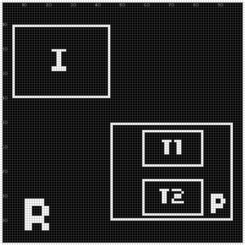

Suppose we want to draw the layout in the figure in the right:
The root layer `R` contains the image layer `I` and panel layer `P`, which
contains the text layers `T1` and `T2`.

The next code listing implements this layout:

- `root`: predefined layer in `pico-lua`, representing the world
- `I`: created with `pico.layer.image` with `root` as parent
- `P`: created with `pico.layer.empty` with `root` as parent
    - `T1`: created with `pico.layer.text` with `P` as parent
    - `T2`: created with `pico.layer.text` with `P` as parent

<table>
<tr><td><pre>
> pico.init(false) ; pico.init(true)
> do
    pico.layer.image("root", "I", "open.png")
    pico.set.scene { "I", target = {'%', x=0.3, y=0.3, w=0.4} }
  end
> do
    pico.layer.empty("root", "P", {w=100, h=50})
    pico.set.effect { "P", color='silver' }
    pico.set.scene  { "P", target = {'%', x=0.7, y=0.7, w=0.4} }
>   do
        pico.layer.text("P", "T1", 20, "Hello")
        pico.set.scene { "hello", target = {'%', x=0.5, y=0.3, h=0.6} }
    end
>   do
        pico.layer.text("P", "T2", 20, "World!")
        pico.set.scene { "world", target = {'%', x=0.5, y=0.7, h=0.4} }
    end
  end
> pico.output.present()
</pre>
</td><td>
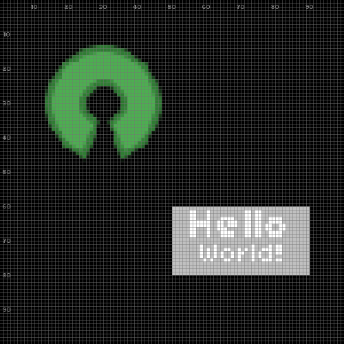
</td></tr>
</table>

After the scene is composed, we simply call `pico.output.present` to update
the screen all at once.

## 8. Expert Mode

By default, each drawing operation in the root layer becomes immediately
visible on the screen.

However, to keep visual objects in perfect sync, most games and non-trivial
applications require to draw them simultaneously on every frame.

With `pico.set.expert`, drawing operations are buffered until an explicit
call to `pico.output.present`, which updates the screen with all objects at
once:

<table>
<tr><td><pre>
> pico.init(false) ; pico.init(true)
> pico.set.expert(true)
> pico.output.draw.rect { '%', x=0.33, y=0.33, w=0.4, h=0.4 }
> pico.input.delay(1000) -- artificial delay
> pico.output.draw.rect { '%', x=0.66, y=0.66, w=0.4, h=0.4 }
> pico.input.delay(1000) -- artificial delay
</pre>
</td><td>

</td></tr>
</table>

Although the code above takes at least `2s` to complete, nothing appears on
the screen yet, since we have not called `pico.output.present`:

<table>
<tr><td><pre>
> pico.output.present()
</pre>
</td><td>

</td></tr>
</table>

Now, both the rectangles appear at the same time.

### 8.1. Application Main Loop

Typical games and graphical applications need to deal continually with moving
objects, input from users, and also the passage of time.
These applications follow the same structure of a continuous "main loop":
    poll user events,
    update the state of objects,
    redraw the whole scene (a frame), and
    repeat at a given *FPS rate* (frames per second).

This is what a main loop in `pico-lua` looks like:

```
-- (this is just a sketch - do not execute)

pico.set.expert(true, 40)           -- 40 FPS

while true do                       -- main loop
    pico.output.clear()
    pico.output.*()                 -- scene redrawing
    pico.output.present()

    local e,dt = pico.input.event() -- event / timeout awaiting

    if e then
        (normal lua code)           -- event handler (keys, mouse)
    else
        (normal lua code)           -- timeout handler (animations, collisions)
    end
end
```

The call to `pico.set.expert` serves two purposes:

1. Disables automatic screen update that would happen after every single draw
   call.
    Now, all redrawing between `clear` and `present` appears as a single frame.
    Even with hundreds of objects, the screen update is instantaneous.

2. Sets the FPS rate to `40`, making `pico.input.event` awake every `25ms`.
    If an event occurs in the meantime, say after `10ms`, then `e` is set and
    the next call to `pico.input.event` resumes after only `15ms` (`25-10`).

If the `FPS` argument is omitted, `pico.input.event` only awakes from events,
but never from timeouts.

### 8.2. A Simple Example

The next example tracks the position of two pixels on a `10x10` screen:

- one follows the mouse, wherever it moves to;
- the other responds to the arrow keys.

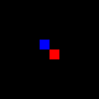

The complete source code is [here](rects.lua) (`~40` lines of code).

Run the program:

```
$ pico-lua rects.lua
```

Now, let's discuss the implementation:

```lua
-- (omitted initialization - do not execute)

pico.set.expert(true)               -- no timeouts

local k = {'!', x=4, y=4}           -- key pixel
local m = {'!', x=5, y=5}           -- mouse pixel

while true do                       -- main loop
    pico.output.clear()             -- redraw scene
    pico.set.pencil { color='red' }
    pico.output.draw.pixel(m)
    pico.set.pencil { color='blue' }
    pico.output.draw.pixel(k)
    pico.output.present()

    local e = pico.input.event()    -- handle events
    assert(e, "no FPS set here")
    if e.tag == 'mouse.motion' then
        m = pico.get.mouse '!'
    elseif e.tag == 'key.dn' then
        if     e.key == 'Up'    then k.y = k.y - 1
        elseif e.key == 'Down'  then k.y = k.y + 1
        elseif e.key == 'Left'  then k.x = k.x - 1
        elseif e.key == 'Right' then k.x = k.x + 1
        end
    end
end
```

Since this example does not contain time-based animations, we do not set FPS in
`pico.set.expert`, so `pico.input.event` awaits until an event occurs.

The tables `m` and `k` represent the pixels controlled by the mouse and
keyboard, respectively.
They use the raw mode `'!'` and start centered at `(4,4)` and `(5,5)`.

The main loop first draws their initial positions and awaits
`pico.input.event`.
In this example, we only handle `mouse.motion` and `key.dn` events:

- for the mouse, we update `m.x` and `m.y` based on the received event `e`;
- for the keyboard, we update `k.x` or `k.y` depending on `e.key`.

Then, the loop iterates to redraw the scene and wait for the next event.

### 8.3. Animations

The next example creates two time-based animations that require to set
`pico.set.expert` with FPS.

We want the characters to move along the rectangular paths, in opposite
directions, and at different speeds.
The animation in the left is based on the sprite sheet in the right:

<table>
<tr><td align="center">
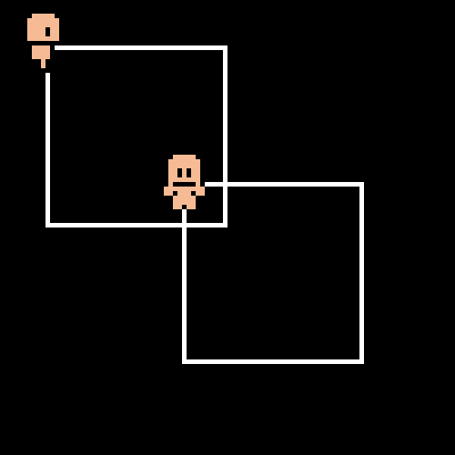
</td><td align="center">

<br>
<small>
    Credits:
        <a href="https://opengameart.org/content/simple-character-base-16x16">
            OpenGameArt.org
        </a>
</small>
</td></tr>
</table>

The complete source code is [here](anims.lua) (`~75` lines of code).

Run the program:

```
$ pico-lua anims.lua
```

Now, let's discuss the implementation.
The overall structure is always the same:

```lua
-- (omitted initialization - do not execute)

pico.set.expert(true, 20)

local f1, x1, y1 = walk('clock',   0, 0)    -- clockwise (faster)
local f2, x2, y2 = walk('counter', 0, 0)    -- counter clockwise

local step = 0

while true do                               -- main loop
    pico.output.clear()                     -- redraw the scene
    pico.output.draw.rect {
        '%', x=0.3, y=0.3, w=0.4, h=0.4     -- rect path (top-left)
    }
    pico.output.draw.rect {
        '%', x=0.6, y=0.6, w=0.4, h=0.4     -- rect path (bottom-right)
    }
    pico.output.draw.layer (
        f1, {'%', x=x1, y=y1, w=0.15}       -- clockwise sprite
    )
    pico.output.draw.layer (
        f2, {'%', x=x2, y=y2, w=0.15}       -- counter sprite
    )
    pico.output.present()

    local e = pico.input.event('quit')      -- handle events
    if e then
        break
    end

    step = step + 1                         -- handle animations
    f1, x1, y1 = walk('clock',   step*2, step)
    f2, x2, y2 = walk('counter', step,   step)
end
```

Now, we set FPS to `20` to animate the sprites every `50ms`.

The function `walk` (see the full source) receives a clock direction and the
current step, returning the sprite and positions to apply.

The main loop redraws the whole scene (rectangle paths and sprites) and awaits
the next clock tick.
In this example, `pico.input.event` either awakes from a `'quit'` event, which
escapes the main loop, or after `50ms`, which applies the next animation step.

In the omitted initialization, we use [#sub-layers](#73-sub-layers) to crop the
`4x4` sprite sheet above:

```lua
local frames = pico.layer.images (
    nil, "walk", "img/walk.png", {'#', w=4, h=4}
)

local dirs = {
    down  = { 1,  2,  3,  4},   -- walk-01 -> walk-04
    up    = { 5,  6,  7,  8},
    right = { 9, 10, 11, 12},
    left  = {13, 14, 15, 16},
}
```

This splits the sprite sheet into layers `"walk-01"` to `"walk-16"`:
walk down (`01-04`), up (`05-08`), right (`09-12`), left (`13-16`).

Then, at each loop step, the call to `walk` decodes the current state and
returns the appropriate `'walk-XX'` layer.
